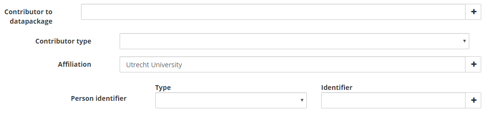

# JSON schema for YoDa

YoDa uses the REACT library for its configurable metadata forms.  
The content of a specific form is held within a JSON schema. Thus each category (=community) can have its own metadata. And consequently its own metadata form.  

## $id
Each json schema starts with the id of the schema.  
This is used as a means to uniquely identify the schema.
Also, it is used to be able to create XSD's with the JSONS2XSD-tool in determining the namespaces as well as location of the resulting XSD's.


```
 "$id": "https://yoda.uu.nl/schemas/default-0/metadata.json",
```


## Definitions - General
Within JSON schema, within the definitions section, metadata can be described.
Definitions
Data type, length and enumerations

### Strings

YoDa string type defitions:
```
"stringNormal": {
  "type": "string",
  "maxLength": 255
},
"stringLong": {
  "type": "string",
  "maxLength": 2700
},
```
These definitions can be used for elements within the jsons form:

```
"properties": {
  "Title": {
    "$ref": "#/definitions/stringNormal",
    "title": "Title"
  },
  "Description": {
    "$ref": "#/definitions/stringLong",
    "title": "Description"
  },  
```  

Thus describing a 'Title' element of datatype stringNormal.  
And 'Description' of datatype stringLong.


### Enumerations


```
"optionsLicense": {
  "type": "string",
  "enum": [
    "Creative Commons Attribution 4.0 International Public License",
    "Creative Commons Attribution-ShareAlike 4.0 International Public License",
    "Open Data Commons Attribution License (ODC-By) v1.0",
    "Custom"
  ]
},
```
Form element 'License'  is described using optionsLicense

```
"License": {
  "$ref": "#/definitions/optionsLicense",
  "title": "License"
},
```


### Default values for elements
REACT form allows default values to be set.

```
"Discipline": {
  "type": "array",
  "items": {
    "$ref": "#/definitions/optionsDiscipline",
    "title": "Discipline",
    "default": ""
  }
```

The default value is '' - an empty string (which is not part of the selection list optionsDiscipline)


### Multiplicity - type='array'
Giving a user the possibility to add specific data multiple times is achieved by using the type 'array'.
This is an indication that the element involved can be added multiple times.
```
"Discipline": {
  "type": "array",
  "items": {
    "$ref": "#/definitions/optionsDiscipline",
    "title": "Discipline",
    "default": ""
  }
},
```

The above example will show a Selection field holding all present options for disciplines.


## Complex structures - type='object'
In order to be able to serve the need to create structures of data the type 'object' is used.
Object in fact constructs a structure that it holds one ore more other elements. The properties attribute holds the elements that constitute this structure.

```
"Collected": {
  "type": "object",
  "title": "Collection process",
  "yoda:structure": "compound",
  "properties": {
    "Start_Date": {
      "type": "string",
      "format": "date",
      "title": "Start date"
    },
    "End_Date": {
      "type": "string",
      "format": "date",
      "title": "End date"
    }
  },
},
```
The above example shows a structure of data  with title 'Collection process'.  
It will show two elements 'Start date' and 'End date'.
The data itself is singular. I.e. only one start date and one end date can be added by the user.


### Dependencies between elements
Dependencies can be added between data. I.e. if data is present in one element, the other element becomes mandatory as well.

```
"Collected": {
  "type": "object",
  "title": "Collection process",
  "yoda:structure": "compound",
  "properties": {
    "Start_Date": {
      "type": "string",
      "format": "date",
      "title": "Start date"
    },
    "End_Date": {
      "type": "string",
      "format": "date",
      "title": "End date"
    }
  },
  "dependencies": {
    "Start_Date": ["End_Date"],
    "End_Date": ["Start_Date"]
  }
},
```

In the example above, Start date and end date are dependent fields.  
I.e. if either one is holding data, the other field must hold data as well.  


## Specific YoDa structure attributes
yoda:structure @TODO  
-compound  
A combination of form elements that can be regarded as one element.
-Subproperties  
A subproperty structure is contstructed of 1 main item and a properties section. This section can be an elaborate structure of formelements in itself  
-required  


"yoda:required": true  
YoDa specific indication for handling of mandatoriness of array elements.


## Example of complex structure
Following example show a complex datastructure for Contributor entity.  





*Main structure*   
Main structure is a subproperty structure.  
It consists of Name as leadpropery and the entire structure below  as its subproperty.

The entire Contributor structure can be duplicated. I.e. copied including the entire subpropery structure.

*Subproperty structure*  
Consists of 2 elements (Contributor type and Affiliation) and 1 compound element Person identifier (holding 2 compound elements).

Affiliation and Person Identifier can be added multiple times.  

When a Person identifier type is added, a corresponding identifier is required as well. This is arranged by setting dependencies between the two fields.

JSON representation is as follows:

```
"Contributor": {
  "type": "array",
  "items": {
    "type": "object",
    "yoda:structure": "subproperties",
    "properties": {
      "Name": {
        "$ref": "#/definitions/stringNormal",
        "title": "Contributor to datapackage"
      },
      "Contributor_Type": {
        "$ref": "#/definitions/optionsContributorType",
        "title": "Contributor type"
      },
      "Affiliation": {
        "type": "array",
        "default": ["Utrecht University"],
        "items": {
          "$ref": "#/definitions/stringNormal",
          "title": "Affiliation",
          "yoda:required": true
        }
      },
      "Person_Identifier": {
        "type": "array",
        "items": {
          "type": "object",
          "title": "Person identifier",
          "yoda:structure": "compound",
          "properties": {
            "Name_Identifier_Scheme": {
              "$ref": "#/definitions/optionsNameIdentifierScheme",
              "title": "Type"
            },
            "Name_Identifier": {
              "$ref": "#/definitions/stringNormal",
              "title": "Identifier"
            }
          },
          "dependencies": {
            "Name_Identifier_Scheme": ["Name_Identifier"],
            "Name_Identifier": ["Name_Identifier_Scheme"]
          }
        }
      }
    },
    "dependencies": {
      "Name": ["Contributor_Type", "Affiliation"]
    }
  }
},
```
