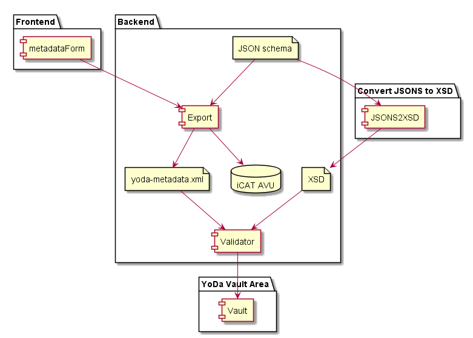

# Metadata of datasets in the vault

## Submit to vault
When requesting a datapackage to be accepted into the vault, its corresponding metadata will be validated first.
Validation will take place against the community metadata JSON.
If this does not exists, validation will take place against the default metadata JSON of the Yoda instance.

## Editing metadata in vault
The metadata form is also used for editing of metadata when the data package has already been accepted and copied to the vault.
A **datamanager**, a yoda-user that is member of a datamanager-group for the same research-group, can still edit metadata for the package that is already in the vault.
However, the data as originally entered by the researcher and accepted for the vault by a datamanager is never compromised / lost.

## Metadata form for the vault
The presented metadata form within the vault uses the same basic technique(s) as in the dynamic storage space.  
It uses the same JSON schema as the research area.
Therefore, the form layout is identical as shown in the research environment.
Also validation of the metadata is identical.

### Permissions
Only the datamanager of the vault-group is allowed to edit metadata.

### Presentation
In the vault environment the data presented in the metadata form is loaded from the latest/newest yoda-metadata.json present within the dataset.

A vault package contains all (previously) saved metadata-files with an extend suffix between brackets to 1) make its name unique and 2) to see a timeorder

yoda-metadata[1554743001].json
yoda-metadata[1554733000].json

### IMPORT
The latest vault yoda-metadata file for the datapackage is loaded into PHP.
A JSON object is created holding all required data for the frontend.
The corresponding JSONSchema (either community or default schema) is required as well to be able to feed the metadataForm.

## Saving metadata
The entire process is handled in a similar way like in the research area.
Main difference is that the new data is not actually overwriting the data in yoda-metadata.json.
The metadata form saves its data in the vault in the corresponding folder but always with a unique name, based upon timestamps.
Thus always safeguarding earlier metadata.

Presented metadata in vault, is always based upon the newest metadata known for datasets in the vault.

### Validation
When a datamanager edits data and saves this, the new metadata is validated agains the proper.  
After posting, the metadata is validated against the metadata JSON schema.
