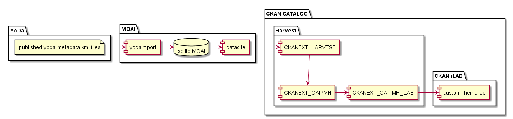

# Yoda MOAI service

## Overview

## Yoda MOAI
MOAI offers harvesting functionality following the OAI-PMH standard with the flexibility to serve different metadata prefixes.
Currently, Dublin Core and DataCite are implemented as a metadata prefix.

## Provisioning MOAI database
When publishing datasets from within Yoda, the corresponding yoda-metadata.xml is put in a location where the Yoda MOAI service can read and process it.  
Each 5 minutes (configurable) the indicated folder is scanned and newly published XML files are provisioned to the internal SQLite database.  
The data is prepared in the database as such that it is able to provide output in XML form, on request of a harvester.
Any OAI-PMH harvester able to read the Dublin Core and DataCite format is able to harvest Yoda through the endpoint serviced by MOAI.

## Yoda MOAI Technical
### Provision from Yoda  
*Python -> yoda.py*  
The  script reads all yoda-metadata.xml files that have been published and are placed in a specific folder.
After processing it puts the found content into the Yoda MOAI SQLite database.

*'Collection name' as metadata for a dataset*  
A collection name defines an umbrella for different datasets to belong together.  
By exposing collection names through MOAI, it is possible for a harvester to draw conclusions regarding datasets from the same data supplier about datasets that belong together.  
Thus, multiple datasets can setup a collection having the same 'purpose'.  
The nature of this purpose can be defined by the researchers/datamanagers themselves.  

In theory, equivalent collection names can exist over multiple Yoda instances.
Even within the same Yoda instance.  
No validation is performed by Yoda software itself.
So there is no formal safeguarding/protection of the content of collection name.  
Harvesters should be (made) aware of that.  
Initially they should combine collections endpoint/collection

select * from sets;  
select * from records;

### Deliver metadata in datacite format to harvesters  
*python -> datacite.py*  
Prepares the output data in such a way that the application data of Yoda, originally held in yoda-metadata.xml files, can be outputted to an XML response with DataCite as a metadata prefix.
