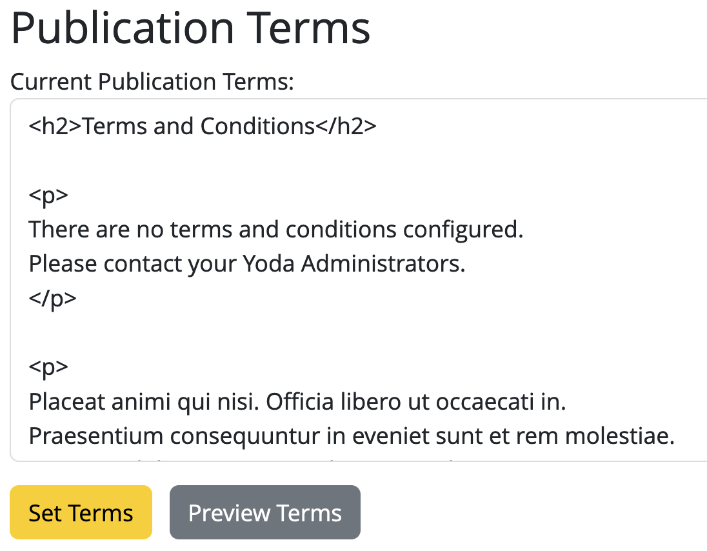

# Installing Terms & Conditions
Terms and conditions for publication are also read from iRODS and presented to the user.
It needs to be an HTML snippet to be rendered correctly.
The naming scheme is up to the administrator, the last .html file placed in
`/rodsZone/yoda/terms` will become the text presented to the user.
In order for every user to be able to read the terms, a read ACL for public needs to be set.

```bash
iput -r /etc/irods/yoda-ruleset/tools/terms /${RODSZONE}/yoda
ichmod -rM inherit  /${RODSZONE}/yoda/terms
ichmod -rM read public /${RODSZONE}/yoda/terms
```

To add a new terms file just put it in the `/${RODSZONE}/yoda/terms` collection with a new name, so the old terms are preserved.

```bash
iput "${TERMS}.txt" "/${RODSZONE}/yoda/terms/${TERMS}.html"
```

From version 1.10, Yoda simplifies managing publication terms with a new GUI on the Admin page.  Just enter and save terms directly in the GUI; they're instantly updated and stored as an HTML page at `/var/www/yoda/config/publication_terms.html`. The system now checks this folder first before looking at the iRODS server for any terms. See the picture below for an example.

<div style="text-align: center;">
    
    <p style="color: gray;">    Example of Publication Terms GUI</p>
</div>

All vault packages with an action log record "submitted for publication" from before the create time of the new terms file were accepted under the old terms.
