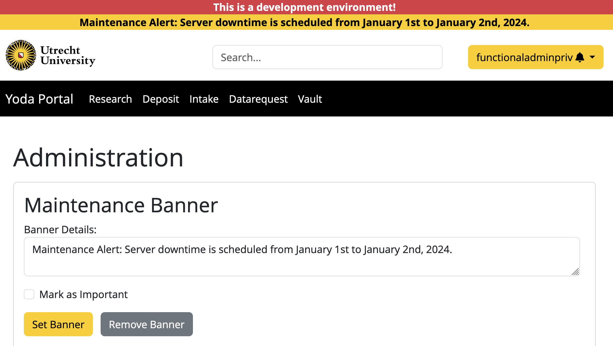

# Setting maintenance banner 
Administrators can easily set or remove the maintenance banner using the Admin page. Configuration settings for the banner are stored in `/var/www/yoda/config/admin_settings.json`. Below is an example of a typical maintenance banner.

    

