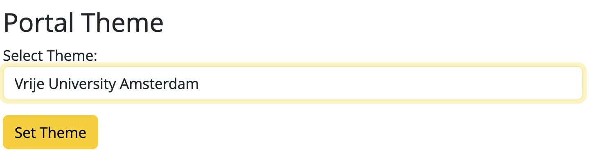

# Setting portal themes via Admin GUI  
From version 1.10, Yoda simplifies setting portal themes with a new GUI on the Admin page. Once the templates are installed in the `yoda/themes/`, just select the theme  directly in the dropdown list; the theme is instantly updated. See the example below for changing the theme to VU.

    
    
Example of Setting Themes with GUI

Below is a list of the pre-installed theme options available. Each theme is presented in the format of template folder : displayed name.

    uu: Utrecht University - Default
    uu_its: Utrecht University - ITS
    uu_gw: Utrecht University - Humanities
    uu_youth: Utrecht University - YOUth
    uu_i-lab: Utrecht University - i-lab
    uu_science: Utrecht University - Science
    uu_fsw: Utrecht University - Social Science
    uu_geo: Utrecht University - Geo
    uu_dgk: Utrecht University - Veterinary Medicine
    uu_dag: Utrecht University - Data Archive for Geoscience (DAG)
    vu: Vrije University Amsterdam
    wur: Wageningen University & Research

To install a new theme to be selected, users need to prepare the theme package following the instructions provided in the [Theme Packages](../design/overview/theme-packages.md) documentation. 
