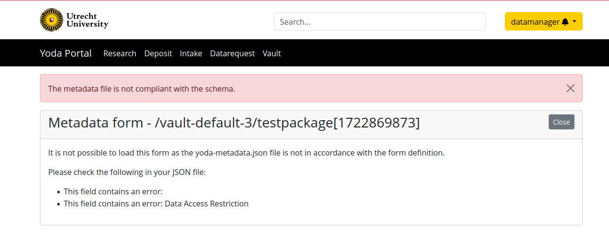

# Troubleshooting problems with updating vault metadata

The vault module in the Yoda portal includes functionality to view
metadata of a data package using the `Metadata` button. Users with
datamanager permissions on the vault group's category can also update
metadata of a data package using the vault module.

There are some situations where this standard functionality cannot be used:
- The vault group has no data managers, for instance if it belongs to
  a category that has no datamanager group.
- The vault group no longer has a research group associated with it.
- The data package metadata no longer matches the active metadata schema.
  This can happen after something went wrong with a schema upgrade, for
  example.

In such cases, a technical admin will need to update the metadata. In older
versions of Yoda, this was done manually. In Yoda 1.10.0 and later, the
`edit-vault-metadata` tool can be used to partially automate such updates.
The sections below describe how to apply this tool in various situations.

## Updating metadata if the group has no data managers

If the vault group does not have a research group anymore or the research
group category has no datamanager group, the metadata generally can't be updated
by a datamanager. If an update of the metadata is needed, it will have to be performed by
a technical admin.

You will have to use the `edit-vault-metadata` tool in direct mode. This
bypasses the normal process by which metadata is updated by (or on behalf
of) a datamanager.

Example usage:
```
$ /etc/irods/yoda-ruleset/tools/edit-vault-metadata.py --direct /tempZone/home/vault-default-3/testpackage[1722869873]
```

## Updating metadata that does not match the schema

It is possible to end up with metadata that no longer matches the metadata
schema in some situations, for example if something went wrong during a metadata
schema upgrade.

In such cases, the metadata form in the vault module can't be edited using the
vault module anymore.  However, when a person who has access to the metadata
(such as a data manager) tries to open the metadata, the portal will typically
provide an error message that indicate what fields do not match the schema.
For example:



After checking in the portal to see what fields need to be updated, a technical
admin can fix these validation errors by editing the metadata. If the vault group
has a research group and data manager group, the edit tool can
be used in default mode (without the `--direct` option), otherwise you need to provide
the `--direct` option. For example, if the vault group's category has a datamanager
group:

```
$ /etc/irods/yoda-ruleset/tools/edit-vault-metadata.py /tempZone/home/vault-default-3/testpackage[1722869873]
```

After any schema validation issues have been resolved by the technical admin, data managers
will again be able to update the metadata themselves using the vault module.
