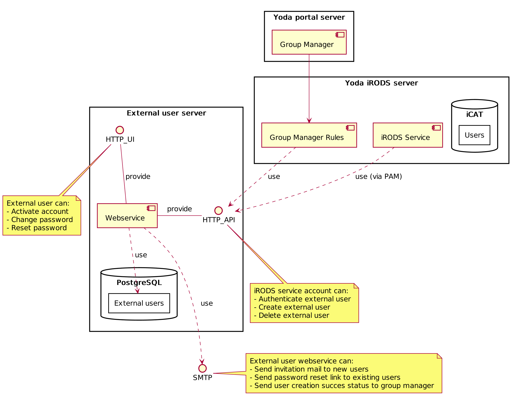
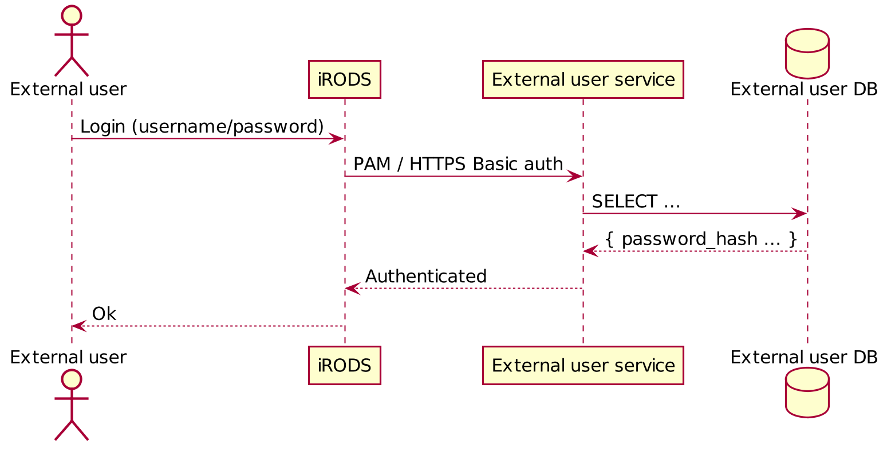
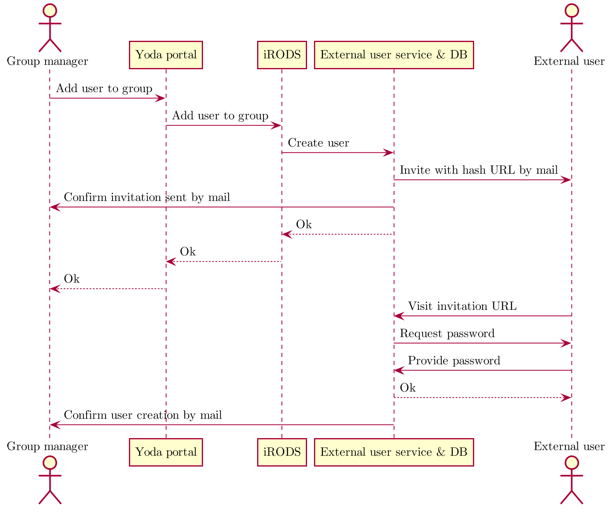
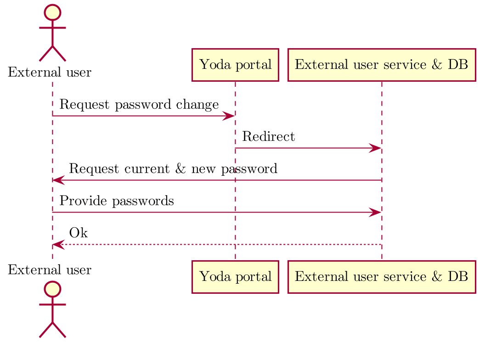

# External User Service

## Introduction
This technical design document describes an approach to implementing
support for enrolling, removing, authenticating, and changing &
resetting the password of external users in Yoda.

## Definitions
-   **Internal user** An internal user is either a user within the UU
    organisation or an administrative user such as `rods`.

-   **External user** An external user is a user that is not part of the
    UU organisation. External users must have an e-mail address as their
    username, that does **not** end in either `@uu.nl` or `.uu.nl`. Any
    username that is an e-mail address and does **not** match above
    pattern belongs to an external user.

## Functional description
The supported workflows are as follows:

### Enrolling an external user
A group manager must be able to enroll an external user.

When a group manager adds a new external user to a group, an invite must
be sent to the e-mail address belonging to the new user. The invite must
contain a generated unique URL that links to a page allowing the user to
create a password and activate their account.

The link must be invalidated either after activation, or if the external
user does not create a password within 5 days.

> *NOTE: How cleanup of unactivated external user accounts should work
> is not yet decided.*

### Authenticating an external user
An external user must be able to authenticate themselves via any
available iRODS interface that offers PAM login.

### Resetting or changing the password of an external user
An external user must be able to reset their password. When a user
submits their e-mail address to the external user service, they will
receive a password reset link. Password restrictions based on
information security guidelines are applied.

### Removing external users
> *NOTE: How removal of external user accounts should work is not yet
> decided.*

## General architecture
### Component view


## Components
### External user database
The external user database must store the username, password, creator and creator zone of external users.
Additionally, a hash can be stored to allow for either account activation or password reset.

When an external user is no longer linked to user_zones the user can be deleted from the users table as well.
This could be a fully automated process later.

The external user database contains the following tables:

**users:**

Col. name     | Type                  | Description
--------------|-----------------------|-----------------------------------------------------------
`id`          | SERIAL                | Numerical (autoincremented) ID  used for internal purposes
`username`    | VARCHAR(64) NOT NULL  | The e-mail address of the external user case-insensitive)
`password`    | CHAR(60) NULL         | A hashed password (`NULL` indicates non-activated account)
`hash`        | CHAR(64) NULL         | A unique hash, used for activation and password reset
`hash_time`   | TIMESTAMP NULL        | The creation time of the hash, used to invalidate hashes
`creator_time`| TIMESTAMP NOT NULL    | The creation time of the user
`creator_user`| VARCHAR(255) NOT NULL | The username of the group manager that had this external user 'created'
`creator_zone`| VARCHAR(255) NOT NULL | The zone the groupmananger is inviting the user from

Index      | Type
-----------|---------       
`id`		   | PRIMARY
`username` | UNIQUE
`hash`     | UNIQUE

The 64-char username limit is prescribed by the iCAT (`DB_USERNAME_LEN`).

**user_zones:**

Col. name      | Type                  | Description
---------------|-----------------------|--------------------------------------------
`user_id`      | INTEGER               | ID of the user involved
`inviter_user` | VARCHAR(255) NOT NULL | The groupmanager that invited the external user
`inviter_zone` | VARCHAR(255) NOT NULL | The zone the groupmanager invited the external user from
`inviter_time` | TIMESTAMP NOT NULL    | The invitation time of the user

Index                   | Type     | Description
------------------------|----------|--------------------------------------------
(user_id, inviter_zone) | PRIMARY  | A user can only be added to a certain zone once.


## Yoda portal
The Yoda portal login page shows a "Forgot / change password" button.
On click, the "Forgot password" page on the external user service for
external users is displayed.
When entering an internal email the internal user should be pointed to the correct location.

### Group manager
The Group manager portal module does not need to be changed to allow for
external user creation. It currently allows creation of users with an
e-mail address as their username.

## Yoda iRODS service

### Authentication
External users will authenticate to iRODS using PAM. A PAM rule must be
added (after `pam_unix` and `pam_radius_auth`) that will authenticate
against the external user database.

The PAM `succeed_if` module must be used in combination with "skip"
actions to select the right authentication module based on a username
glob. This will speed up authentication significantly.

There is a [PAM-pgsql module](https://github.com/pam-pgsql/pam-pgsql/)
that would allow PAM to check credentials directly against the database,
however, it has some drawbacks:

-   This module does not exist in CentOS7 repos. We would need to
    compile it from source (and audit it).
-   The module does not seem to support a safe password hashing
    algorithm (only MD5, SHA1, clear, or a DB function (which would
    require a separate PostgreSQL package to support anything other than
    MD5))

Instead, the `pam_exec` module will be used together with `curl` to
deliver a Basic-authed HTTPS POST request to the external user service,
which will indicate success using the appropriate HTTP status code
combined with an indicative response body text.

This allows the external user database to be closed to outside
connections, as the external user service is the only service that needs
to access the database directly.

The iRODS server will need a secret number (API key) to authenticate
itself to the external service. This number must be stored as a local
file on the server (not within iRODS), in a way that makes it accessible
both to the PAM module and a Python Group manager rule.

Addition:
The external user service keeps track of the zones an external user is invited to.
When authenticating, if a user is not registered within the eus for a zone, the user will not be able to log in to the corresponding Yoda instance.

### Group and user management
The Group manager rules will need to be able to instruct the external
user service to create and remove external user accounts. These requests
must be authenticated with an API key, which must be available to the
iRODS service account, but not accessible to user-submitted rules.

A Python rule is used to fetch the secret from a local file and
make requests to the external user service. Since Python rules can be
called from anywhere in iRODS, the rule itself will need to perform
authorization checks, using existing Group manager policy check
functions `uuGroupPolicyCanGroupUserAdd` and
`uuGroupPolicyCanGroupUserRemove`.

For the **removal** of external users, new functionality must be added,
as user removal is currently not supported in Yoda at all. *How this
will work is still TBD.* Possible solutions include: Automatically
removing the user when they are removed from the last group, and having
a separate user management page for administrators. A periodic cleanup
job may be implemented to automate external user removal.

## External user service

The external user service is a HTTPS server that services requests to a
user management API, used by iRODS; and provides an interface for
external users to activate their account, and change or reset their
password.

The iRODS server, which is the client to the API provided by this
service, is to be fully trusted, and is thus expected to perform all
necessary authorization checks before making a request.

The service will have exclusive access to the external user database.

Additionally, the service must be able to send e-mails to external users
and group managers. E-mails are used for invitations and password
resets.

## Sequence diagrams
### Authentication of an external user


### Enrollment of an external user not known to EUS


### Invitation of external user known to EUS - not known to Yoda instance


### Password reset


### Password change


## Interfaces

### Yoda portal → iRODS
The interface between the Yoda portal and iRODS is unchanged.

### iRODS → HTTP API → External user service
The external user service\'s HTTP API is used by iRODS to authenticate
external user and enroll and remove external users.

All requests from iRODS to the external user service must contain the
header `X-Yoda-External-User-Secret`, containing a secret API key.

When the secret header is not present, the external user service will
respond with a 400 HTTP status code on all API requests. Additionally,
API requests will be restricted to client IP addresses matching the
iRODS server.

POST parameters, if any, are supplied in the request body in JSON
format, for example:

``` {.example}
{ "username": "piet", "creator": "henk" }
```

Endpoint           | Method           | Description
-------------------|------------------|--------------------------------------------------------
`/api/auth-check`  | POST             | User authentication: Credentials supplied via HTTP Basic `Authorization` header..  Response: On failure: 401. On success: 200, with body text `Authenticated`
`/api/user/add`    | POST             | User creation: Creates the given user in the external user database. Generates and stores an activation hash for that username. Sends an invitation e-mail to the new user. Parameters are `username` and `creator`.
`/api/user/remove` | POST            | User removal: Removes the given user from the external user database. The only parameter is `username`.

## External user → HTTP UI → External user service
The HTTP UI is used by the external user to activate their account, and
to change or reset their password.

*TBD: The user should (conforming to GDPR etc.) be able to request for
the removal of their own account, how will they initiate this action?*

All POST parameters are sent in `x-www-form-urlencoded` format.

POST actions that require the use of a hash must fail if the hash is
older than the specified time:

-   For account creation: 5 days
-   For password reset: 15 minutes

Endpoint                               | Method | Description
---------------------------------------|--------|-----------------
`/user/:username/activate/:hash`       | GET    | User activation page. Allows the user confirm the creation of their account.
`/user/:username/activate/:hash`       | POST   | Confirms user activation, sets a password. Also sends an e-mail to the creator of the account. The user's hash is cleared in the database upon use. The only parameter is `password`.
`/user/change-password`                | GET    | "Change password" page. Allows the user to change their password by filling in their username, old and new password.
`/user/:username/change-password`      | POST   | Confirms "Change password". Changes the user's password. Parameters are `password` and `new_password`.
`/user/forgot-password`                | GET    | "Forgot password" page. Allows the user to request a password reset link by filling in their username
`/user/:username/forgot-password`      | POST   | Confirms "forgot password". Generates a hash and sends a password reset link to the given username, if it exists. The only parameter is `username`.
`/user/:username/reset-password/:hash` | GET    | Password reset page. Allows the user to enter a new password
`/user/:username/reset-password/:hash` | POST   | Confirms password reset, sets a new password. The user's hash is cleared in the database upon use. The only parameter is `password`.
