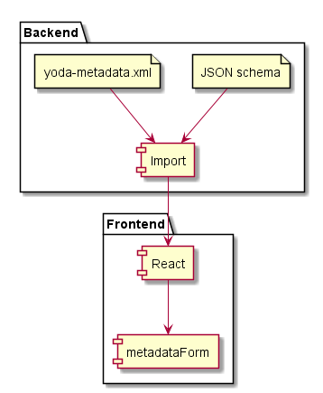
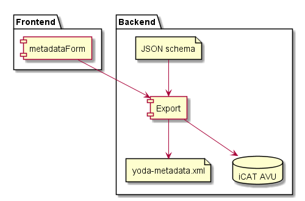

# Metadata import and export functionality

The import and export functionality establishes the bridge between the REACT form, JSON schema based, and the YoDa application XML.

In essence  
-the export functionality transforms the JSON data that was posted by the form into the yoda-metadata.xml conform the Yoda application requirements for the layout of the XML.  
-the import functionality transforms yoda-metadata.xml into JSON that is prepared for handling by he metadata form.


## IMPORT

Purpose:
Build JSON encoded data structure conform the REACT requirements  to ‘feed’ the metadata form as such that YoDa is able to present a metadata form that resembles that original metadataform in functionality as well as gui.




Example CONTRIBUTOR field  

Internal PHP representation of contributor field as read from JSON schema.
The import functionality within the portal software use this structure to be able to determine wheter data is present within yoda-metadata.xml
The resulting JSON object is put to the REACT form.

DIT IS PHP representatie - kan mogelijk anders worden ingezet (bij import????)

```
 [type] = array
 [items]
      [type] => object – JSON form way of saying a nested structure is present
      [yoda:structure] => subproperties   - YODA way of indicating which type of nested structure
      [properties]
              [Name]
                   [$ref] => #/definitions/stringNormal
                   [title] => Contributor to datapackage
               [Contributor_Type]
                      [$ref] => #/definitions/optionsContributorType
                      [title] => Contributor type
               [Affiliation]
                     [type] => array
                     [default]
                           [0] => Utrecht University
                      [items]
                          [$ref] => #/definitions/stringNormal
                          [title] => Affiliation
                          [yoda:required] => 1
                   [Person_Identifier]
                                   [type] = array
                                   [items]
                                              [type] => object
                                               [title] => Person identifier
                                              [yoda:structure] => compound
                                              [properties] => Array
                                                        [Name_Identifier_Scheme] => Array
                                                             [$ref] => #/definitions/optionsNameIdentifierScheme
                                                             [title] => Type
                                                         [Name_Identifier] => Array
                                                               [$ref] => #/definitions/stringNormal
                                                               [title] => Identifier
                                                               [dependencies] => Array
                                                                    [Name_Identifier_Scheme]
                                                                            [0] => Name_Identifier
                                                                      [Name_Identifier] => Array
                                                                            [0] => Name_Identifier_Scheme
```


## Export functionality

Purposes:
- Build yoda-metadata.xml based upon the posted output from the REACT form
- Write metadata to iCAT database so it can be searched



There are two steps involved when the researcher submits the data package to the vault

1. save data in yoda-metadata.xml for the datapackage
Based upon the form definition in formelements.xml the posted metadata is matched and saved into yoda-metadata.xml in the corresponding folder.

  - Data that is not 'known', i.e. not defined in formelements.xml is NOT saved.
  - Incomplete subproperty structures are NOT saved in this situation.

  - Data that is sent as empty strings will not be saved.
    This to keep the metadata that is registered in iCat as effective as possible and not be fully drained with empty metadata values

2. save data from yoda-metadata.xml into AVU's for the datapackage
   Writing the metadata-xml file triggers an iRODS-policy to process the content of the file (in XML format), via a stylesheet, into AVU's.
   The stylesheet 'flattens' the hierarchical XML formatted data so all values have an attribute like where all XML tags are places on one line, like:
   *Contributor_Properties_Identifier_Person_Identifier_Scheme
    elaborated with numeric indexes if multiplicity is involved*

Step 2 also occurs when a researcher places a yoda-metadata.xml file on the web disk.

The main definition can be found in JSON Schema definition

**Subproperty structure:**  
In XML a subproperty structure holds a <Properties> tag to separate the leadproperty area in the structure from the subproperty area.  
This designation is not present within the JSON schema representation and has to be added while transforming  the JSON data to XML


** indexed search on metadata **  
Adding values to the iRODS iCAT database, based upon an XSLT, makes search actions possible from the portal within the metadata.
