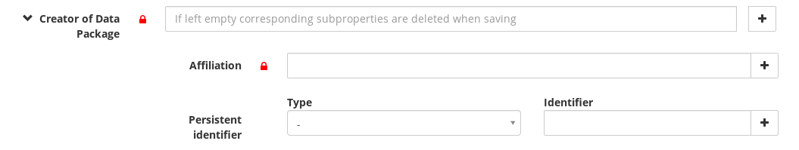

# Metadata form

## Introduction
A Yoda instance holds research information regarding communities (categories).
The type of research data can differ between communities.
Metadata that has to be registered together with research data that can differ as well between communities.

Yoda supports communities to use their own metadata accompanying their research by giving them the support of a specific metadata form. If no form exists for a specific community then the standard metadata form is used.

## Generic implementation
The metadata form handling is generically implemented. It can be used within several situations/contexts and is used eg. both within the dynamic storage area as well as the vault.

In itself the generic metadata form deals with two situations, i.e.
- an editable form in which users can edit/add metadata to a datapackage
- a readonly view on this metadata as previously entered by a researcher

What the generic metadata form deals with:
- Presenting a form for the metadata of a specific datapackage where the elements on the form are configurable dependent on category
- A default metadata form configuration when no metadata form configuration exists for a category
- Possibility to have dependencies between elements on the form in order to form clear relations between the data
- Determining completeness of the form and giving proper indications to the user dependent on the category a datapackage belongs to
- Determining validity of the metadata form data dependent on the category a datapackage belongs to
- Saving the metadata to a file in XML format within the datapackage (called yoda-metadata.xml)
The file that can be edited via web disk as well by users with sufficient permissions
- When data is saved correctly add the metadata to iCat system as AVU’s to the corresponding datapackage information as well. This so these metadata entries can be searched by users
- Offering possibilities to, after correctly/successfully validating a metadata set, the result can be used for further actions.  Like the ability
  - to bring a datapackage / metadata to the vault from within the dynamic storage environment
  - to save several metadata files, with unique names, within the vault
- readonly view on metadata for a datapackage


## Metadata form: files involved

A metadata form is constructed with the contents of following files.

**metadata.json**

An JSON file that mainly holds the structural definition of the metadata form as well as mandatoriness.
This file has been designed for the Yoda implementation and is based on the [JSON schema specification](https://json-schema.org/).

**yoda-metadata.xml**

A XML file holds the actual metadata as entered by the researcher and is kept within the corresponding datapackage.
The file is editable for the researcher in dynamic storage area when not in a locked state. It is editable by any user that is not limited to readonly-rights.
The structure of the file must comply to the metadata.json that applies.

### Getting the correct file paths
Both files are required for the generic functionality to work correctly.
iRODS offers the specific situational filenames for correct configuration of the metadata form.
The situation (dynamic storage, vault etc) is passed and based upon the full pathname of a datapackage which gives iRODS the required insight:

$formConfig = $this->filesystem->metadataFormPaths($rodsaccount, $fullPath);
This returns a number of parameters but the three of importance are:

**metadataXmlPath**

Holds the path to the metadata file that holds the data as entered by a Yoda user.
In the dynamic storage this would be yoda-metadata.xml file.

## metadata.json explanation

The metadata.json file mainly holds all information for the metadata form:
1. Declaration of groups of elements
2. Element names corresponding to the XSD
3. Element specifics intended for the researcher, like
  - Label of the input element
  - tooltips when hovering over the field
  - Default value when no metadata has been saved yet
4. Mandatoriness of metadata
Metadata fields can be configured as being mandatory when requested to be accepted in the vault.

Subproperties can be made mandatory for the vault.
Implicit rules apply for subproperties/compounds in special structures as will become clear further on.

### File location
metadata.json should be put in the following iRODS collection:
/tempZone/yoda/schemas/default/

### Metadata JSON examples

**1. Declaration of groups of elements**


ElementGroups such as ‘Descriptive’ make a form more readable and understandable. Especially when the form is elaborate.

Within XML formelements.xml ElementGroups are added as follows:

```xml
<?xml version="1.0" encoding="utf-8"?>
<formelements>
	<Group name="Descriptive">
	</Group>
	<Group name="General">
	</Group>
</formelements>
```

This will create a metadataform consisting of two groups: “Descriptive” and “General”. Elements within the Group tags will belong to that group in the form.
The order of appearance in formelements.xml is the order the groups are shown in the metadataform itself.

**2. Element names corresponding to the XSD**

```xml
<?xml version="1.0" encoding="utf-8"?>
<formelements>
	<Group name="Descriptive">
		<Title></Title>
		<Description></Description>
	</Group>
	<Group name="General">
	</Group>
</formelements>
```

Every element other than the reserved elements (formelements, Group, label, help and attribute class=”compound”) correspond to an identifier of metadata field.
In these examples eg. ‘Title’ and ‘Description’ are identifiers of the element.
These correspond to the same identifier in the XSD. Thus making it possible to combine both files (‘formelements’ and ‘xsd’) to be able to construct a metadata form.
Both from their own perspective.
The XSD holds information regarding limitations/requirements of the actual data as added by the user.

**3. Labels, tooltips/help text**

For the datapackage title element following construction

```xml
	<Group name="Descriptive">
		<Title>
			<label>Data Package Title</label>
			<help>The title of your data package</help>
		</Title>
```
The help text will become visible when hovering over the label of the field.

**4. Default values**

When opening the form and no corresponding yoda-metadata.xml exists, the metadataform will present the default value. If configured.
In below example the default value for Retention Period in this metadata form is 10.


```xml
		<Retention_Period>
			<label>Retention Period</label>
			<help>The minimal number of years the data will be kept in the archive</help>
			<default>10</default>
			<mandatory>true</mandatory>
		</Retention_Period>
```

**5. Mandatoriness**

Mandatoriness signifies that metadata must be present when requesting acceptance for the vault.
If a mandatory field  holds no value, the request will not be accepted by the system and the user is asked to fill out the missing data.

```xml
		<Retention_Period>
			<label>Retention Period</label>
			<help>The minimal number of years the data will be kept in the archive</help>
			<default>10</default>
			<mandatory>true</mandatory>
		</Retention_Period>
```


signifies that the corresponding field is mandatory for the vault.


signifies that the field is mandatory and the field is filled out correctly

These indications are actual directly after saving or showing the metadata form.
These are not real time indications so changes by the user are not followed and indicated directly (in real time).

## XSD explanation
The XSD lays down the requirements for the data the metadata has to comply to.
It describes properties as length and datatype.
For selects it determines all the selectable options.
Thus, the data in the form can be validated against the XSD.
The XSD does not hold information regarding mandatoriness of data for the yoda-implementation.

### File location
All XSD’s should be put in the following iRODS collection:
Location: /zone/yoda/xsd

### Element types
Any form consists of input elements or fields.  
In Yoda the metadata form is comprised of the following elements:

- text elements: simple length restricted input elements for text, numeric and uri’s
- multiline text elements also known as text area’s
- select elements that can bring up configurable options
More specifically with a search possibility in the element through the option list
- date selection elements

### Element type specifics
The identifiers as mentioned in the formelements.xml file are present in the XSD as well.
Thus, it is possible to combine the information and distinguish data specifics of all the elements within the metadata form.

### In the XSD file:
All elements are assigned a type. Either a primitive type or a type defined in the XSD itself. The specifics of the primitive types can be found in the definition of the XSD standard at: https://www.w3.org/TR/xmlschema-2

**Type = xs:date**
Brings up a date picker element.
This field will be validated against the primitive xs:date type.

**Type = stringURI**
Brings up a text field in the metadata form with a maxLength as set in the simpleType definition in the XSD. This text field based on the primitive type xs:anyURI, but with an extra restriction that the max length is 1024 characters. URI do not have an official max length but in practice longer URIs can be problematic.
The simpleType can be modified if required.
```xml
        <xs:simpleType name="stringURI">
            <xs:restriction base="xs:anyURI">
                <xs:maxLength value="1024"/>
            </xs:restriction>
        </xs:simpleType>
```

**Type = stringNormal:**
Brings up a text field in the metadata form with a maxLength as set in the simpleType definition in the XSD. This text field can hold any data and will only be checked for a max length of 255 characters.
```xml
        <xs:simpleType name="stringNormal">
                <xs:restriction base="xs:string">
                        <xs:maxLength value="255"/>
                </xs:restriction>
         </xs:simpleType>
```

**Type = xs:integer:**
Brings up a text field that can only hold numeric data.
Specifically this is limited to 10 digits.
This number will be validated against the primitve type xs:integer.

**Type = xs:anyURI:**
Will bring up a text field with a length of 1024 characters.
The URI will be validated against xs:anyURI definition

**Type = stringLong:**
Brings up a text area element.
The maximum length is taken from the simpleType definition as configured in the same XSD and the data will be validated accordingly.
```xml
        <xs:simpleType name="stringLong">
                <xs:restriction base="xs:string">
                        <xs:maxLength value="2700"/>
                </xs:restriction>
         </xs:simpleType>
```

**Type = optionsAnyName:**
Any type prefixed with the word “options” should be associated with a list of values.
This will bring up a select field with options as configured in the simpleType definition in the XSD.

```xml
  <xs:simpleType name="optionsNameIdentifierScheme">
    <xs:restriction base="xs:string">
      <xs:enumeration value="ORCID"/>
      <xs:enumeration value="DAI"/>
      <xs:enumeration value="Author identifier (Scopus)"/>
      <xs:enumeration value="ResearcherID (Web of Science)"/>
      <xs:enumeration value="ISNI"/>
    </xs:restriction>
  </xs:simpleType>
```

**Reserved/protected words:**
A developer can add changes to XSD’s. Create own simpleTypes etc.
The following list contains words not to be used and defined as simpleTypes:

- structSubPropertiesOpen
- structSubPropertiesClose
- structCombinationOpen
- structCombinationClose


### Multiplicity
Some form data data can be present in multiple instances.
This can be achieved by using ```maxOccurs="unbounded"``` on the element level in the XSD. (or any other integer value if a specific restriction in multiplicity exists for a given element)

**Important note:**
minOccurs cannot not be used and should remain set at zero at all times.
When set to 1 (or more) submitting an incomplete metadata form by a user will lead to failure opening the metadata form again.
XSD-validation is the first step when opening a metadata form. As the metadata that was submitted is missing data, the form will show the validation errors found instead of the metadata form itself.
As it is not expected the user to fill out a metadata form completely in one go it is impossible to add manditoriness in the XSD.
Consequently, manditoriness of data is moved to formelements.

### Data validation
In general, when submitting a datapackage to the vault, its metadata is validated if correct and complete:
1. Test for validity
This is a test directly against the corresponding XSD.
2. Test for completeness
This is a test on the basis of mandatory-settings for each element in formelements.


## Example of a metadata field XSD and formelements


Location(s) covered can be entered multiple times.
The XSD holds:

```xml
<xs:element name="Location_Covered" type="stringNormal" minOccurs="0" maxOccurs="unbounded"/>
```

The stringNormal type signifies a normal input with length 255 (see XSD simpleTypes definitions).
```maxOcccurs=”unbounded”``` will add the plus-sign to the form element. Thus allowing for cloning of the element and giving the element the possibility to hold multiple values.

When data validation occurs it is also validated against maxOccurs.
maxOccurs can have any value as accepted by XSD standard, but currently only 1 or unbounded make sense.

Corresponding formelements entry could look like the following:

```xml
<Location_Covered>
      <label>Location(s) covered</label>
      <help>Indication of the geographical entities, like countries, regions and cities, covered with this data package (English naming convention preferred)</help>
</Location_Covered>
```

This element could be made mandatory by adding ```<mandatory>true</mandatory>``` on the same level as label and help.


## Special structures of elements
### Subproperty structure
Subproperties designate a structure consisting of
1. one lead element
2. N elements (subproperties) linked to the lead element organised as one group

The lead elemenent can be of every type as mentioned earlier.

#### Implicit mandatoriness
Subproperties cannot exist without the lead information being present.
Saving subproperties that have no lead-data will be deleted when saved.
I.e. the lead information becomes implicitly mandatory when subproperty data exists.

#### Mandatory subproperty within a subproperty structure
A subproperty can be configured as being mandatory.
This rule only applies when lead information is present.

#### Subproperty Structure
The structure is designated by a ```<Properties>``` section. (Stylesheet implementations count on this being present).

For example:
```xml
<Related_Datapackage>
<Title>
<label>Predecessing Data Package</label>
<help>Title of the previous version of this data package</help>
</Title>
<Properties>
<Persistent_Identifier>
<label>Persistent Identifier</label>
<help>Persistent identifier of the previous version of this data package</help>
</Persistent_Identifier>
<Persistent_Identifier_Type>
<label>Type of Persistent Identifier</label>
<help>Type of Persistent identifier of the previous version of this data package</help>
</Persistent_Identifier_Type>
</Properties>
</Related_Datapackage>
```
In the above example a lead element ‘Related Datapackage’ has two subproperties “Persistent Identifier” and “Persistent identifier type”

#### Multiplicity/cloning for subproperty structure:
The entire structure can be cloned (if set to multiple within the XSD).
Subproperties themselves can be cloned if configured in XSD.
Compound fields (see further) can be treated as subproperties and all the above rules will be applicable to these a well (and their own compound properties will be maintained as well)

### Compound elements

A compound element is an element that consists of several, at least one, related elements.
They are considered to belong together and in that sense treated in that manner.

In order to distinguish combination fields from other elements a compound element is created by adding class=compound to the given element required to be a compound element.
In the next example License and Link webpage belong together (one license has one related webpage):


Formelements.xml for the above example could look like the following:
```xml
<License class="compound">
                        <Name>
                          <label>License</label>
                          <help> The license under which you offer the data package for use by third parties. Preferred value is "CC By 3.0"</help>
                          <default>To be defined</default>
                        </Name>
                           <URL>
                             <label>Link Webpage</label>
                             <help> A link to a webpage describing the license and its conditions. In case of CC By 3.0 'https://creativecommons.org/licenses/by/3.0/'</help>
                           </URL>
</License>
```

Corresponding XSD:
```xml
<xs:element name="License" minOccurs="0" maxOccurs="unbounded">
<xs:complexType>
                <xs:sequence>
                     <xs:element name="Name" type="stringNormal" minOccurs="0" maxOccurs="1"/>
                     <xs:element name="URL" type="stringURI" minOccurs="0" maxOccurs="unbounded"/>
                </xs:sequence>
            </xs:complexType>
</xs:element>
```

#### Multiplicity/cloning of compounds
Entire element can be made cloneable – thus cloning the total structure in its entirety
Given XSD (above) shows how on the highest level (maxOccurs=”unbounded”)
So several license/URL combinations (i.e. compounds) could be added.

Each individual constructing element within the compound can be made cloneable as well– thus cloning the element within its compound element.
In the above example it is even possible to add multiple URL’s per License name
The name itself cannot be cloned.

**Implicit mandatoriness when compound is partly filled.**
If one element of a compound is filled, all the others have to be filled as well. These are considered mandatory as well.
Partly filling a compound is not accepted as being valid information


#### Label for compound field main level


To add an overall label to a main level compound field add <label> tag just within the designating compound tag in formelements:
```xml
    <Collected class="compound">
      <label>Collection process</label>
      <help>Indicate when collecting the data for this data package started</help>
      <Start_Date>
        <label>Start Date</label>
        <help>Indicate when you've started collecting the data for this data package (YYYY-MM-DD)</help>
      </Start_Date>
      <End_Date>
        <label>End Date</label>
        <help>Indicate when you've finished collecting the data for this data package (YYYY-MM-DD)</help>
      </End_Date>
    </Collected>
```


### Compound field as a subproperty

A compound field can be regarded as being a single element. Therefore, it can also be used as a a subproperty.
This is especially useful when the need exists to save the relation of one leading element and a set of information that belongs together.
For instance the relationship between a person (lead element) and the ID and type of ID that always go together.


Type of persistent identifier and persistent identifier are a compound field in this subproperty structure.

```xml
    <Contributor>
      <Name>
        <label>Contributor(s) to Data Package</label>
        <help>The name(s) of the persons who have contributed to this data package</help>
      </Name>
      <Properties>
        <Contributor_Type>
            <label>Contributor Type</label>
            <help>See dataCite</help>
            <mandatory>true</mandatory>
        </Contributor_Type>
       <Affiliation>
          <label>Affiliation</label>
          <help>The organizational or institutional affiliation of the creator</help>
          <default>Utrecht University</default>
        </Affiliation>
        <Identifier_Person class="compound">
          <Name_Identifier_Scheme>
            <label>Type of Persistent Identifier</label>
            <help>What type of persistent person identifier</help>
          </Name_Identifier_Scheme>
          <Name_Identifier>
            <label>Persistent Identifier</label>
            <help>Persistent identifier of contributor (e.g. an ORCID, DAI, or ScopusID)</help>
          </Name_Identifier>
        </Identifier_Person>
      </Properties>
    </Contributor>
```

XSD:
```xml
<xs:element name="Creator" minOccurs="0" maxOccurs="unbounded">
   <xs:complexType>
     <xs:sequence>
       <xs:element name="Name" type="stringNormal" minOccurs="0" maxOccurs="1"/>
       <xs:element name="Properties" minOccurs="0" maxOccurs="1">
         <xs:complexType>
           <xs:sequence>
             <xs:element name="Affiliation" type="stringNormal" minOccurs="0" maxOccurs="unbounded"/>
             <xs:element name="Identifier_Person" minOccurs="0" maxOccurs="unbounded">
               <xs:complexType>
                 <xs:sequence>
                   <xs:element name="Name_Identifier_Scheme" type="optionsNameIdentifierScheme"               minOccurs="0" maxOccurs="1"/>
                   <xs:element name="Name_Identifier" type="stringNormal" minOccurs="0" maxOccurs="1"/>
                  </xs:sequence>
               </xs:complexType>
             </xs:element>
           </xs:sequence>
         </xs:complexType>
       </xs:element>
     </xs:sequence>
   </xs:complexType>
</xs:element>
```

#### Mandatoriness
Again, if one of the compound elements fields holds data, the other element(s) become mandatory as well. I.e. data cannot be saved when a compound field is not fully filled out.


#### Multiplicity/cloning entire compound
A compound field can be regarded as one element.
Therefore, it can be cloned in its entirety adding one (or more) cloned compounds to the lead element.

#### Multiplicity – cloning element(s) within a compound
As a compound is constructed with normal elements it is possible to add cloning to each or one specific element within a compound element.


### Label for compound field as subproperty



To add an overall label to a subproperty level compound field add <label> tag just within the designating compound tag in formelements:

```xml
    <Creator>
      <Name>
        <label>Creator of Data Package</label>
        <help> The name of the person(s) who created (a version of) the data package</help>
        <mandatory>true</mandatory>
      </Name>
      <Properties>
       <Affiliation>
          <label>Affiliation</label>
          <help>The organizational or institutional affiliation of the creator</help>
          <default>Utrecht University</default>
          <mandatory>true</mandatory>
        </Affiliation>
         <Person_Identifier class="compound">
          <label>Persistent identifier</label>
          <Name_Identifier_Scheme>
            <label>Type</label>
            <help>What type of person identifier is used? </help>
          </Name_Identifier_Scheme>
          <Name_Identifier>
            <label>Identifier</label>
            <help>Identifier as it can be resolved on the appropriate service</help>
          </Name_Identifier>
        </Person_Identifier>
      </Properties>
    </Creator>
```

## Technical implementation
metadata_form_model contains all required functionality.

The main function is: getFormElements
It collects all required data and organises in one resulting array $this->presentationElements

This array forms the basis for all further actions like presentation, validation and completeness checking.

### Steps:
Depending on category, load:
1. corresponding XSD
Data held in one dimensonal array, flattened copy of the hierarchical data, to be indexed by 'CONTRIBUTOR_PROPERTIES_'
(which can be easily accomplished when stepping through the formelements)

2. corresponding formelements
This forms the base for all steps.
Formelements lays down the structure of the elements

3. yoda-metadata.xml
The actual data as entered by a researcher.

Each element shown/required in the front-end is represented as an element class in the array fed to the front end.

**key =>**
Name of the element that is used in the attribute "name" for an input element in the metadata form.

The name of an element is fully prefabricated for the frontend by the backend.
This is done to be able to control the structural integrity as, on different levels in a element structure, multiplication can take place within the frontend (see frontend handling as well)

The following example shows two levels of multiplicity:


A ‘Creator’ structure can be cloned in its entirity
Within that structure ‘Person identifier’ information can be cloned as well.
All configured within the corresponding XSD.

The backend prefabricates the name-attributes of the elements, i.e. the key, conform their hierarchical place in this structure, like:

```
Creator[0][Properties][Person_Identifier][0][Name_Identifier]
```

A second structure would be:

```
Creator[1][Properties][Person_Identifier][0][Name_Identifier]
```

And a second Person Identifier compound within that second structure would be:

```
Creator[1][Properties][Person_Identifier][1][Name_Identifier]
```

*Why is the name of an element even important?*

The name attribute of an element is used to define the structure of data that is posted to the backend.
In setting this right initially, and after cloning keeping this correct, the backend is fed with a representation of the data as entered by the user it can process.
This will eventually lead to a correctly filled yoda-metadata.xml and metadata

**value =>** value for the element

**label =>** title for the element

**helpText =>** tooltip for the element

**type => **
- Data input types:
  - date
  - text
  - numeric
  - date
  - etc.

- Open/close tags
The open/close tags are indicators for the frontend for designating blocks of data. These do not become interactive elements but the sole purpose is formatting
1. for designating properties of a subproperty structure.
2. for designating a compound structure.


**mandatory =>**
indicates whether the given element is mandatory for submission to vault.

**multipleAllowed =>**
indicates whether element can be recorded multiple times

**elementSpecifics =**>
- Placeholder for options when element is a select.
- maxLength of a text field
Created in a open way so future additions can be accommodated easily in here

#### Regarding subproperties:
- **subPropertiesRole**
the role of current element in the subproperty structure
{subPropertyStartStructure, subPropertyStartStructure, subProperty}
This for the frontend to be able to distinghuish actual supProperties (i.e. Elements) from indicators that merely support the frontend displaying and functioning correctly

- **subPropertiesBase**
the name of the highest level key of the struct

- **subPropertiesStructID**
an ID so the frontend can distinguish structs
To be able to have the frontend minimize or maximize a specific structure

#### Regarding compounds:
- **compoundMultipleAllowed**
This inidicates whether given element is part of a compound that is cloneable.

- **compoundFieldCount**
The total amount of fields that are part of this compound

- **compoundFieldPosition**
The M-th element in a range of N.
This is mainly for the front end to know which element is first and last. Mainly in order to be able to do some ‘esthetics’.
Position is zero

- **compoundBackendArrayLevel**
This is useful for the frontend to know which level cloning takes place.
It is the level on which the counter has to be changed in order to keep track of cloning in the name-attribute of a cloned element.
Cloning (a frontend action) can be done where multiplicity is allowed.
The backend relies on the names of the elements in the frontend for knowing how data is linked together.
The frontend is aided in the complex task of deriving element-names when determining a new (increased) element name for a cloned element by the use of  compoundBackendArrayLevel:

*Frontend management of counters*
The frontend holds one global counter.
This counter is incremented each time it is used. I.e each time a user performs a clone action.

There is no required logic in using the numbers. Not on any level.
Main principal is that the next to be used number is unique on that level.

```php
Related_Datapackage[0]Compound[0]Name = Test
Related_Datapackage[0]Compound[0]ID = 1
```

Both levels are multiple.
There can be N Related datapackages present as metadata.
And within each datapackage multiple compounds, holding name and id, can exist.

The indicator compoundBackendArrayLevel on start-combination level, ie Compound level, indicates how deep (i.e. Which counter) has to be changes when cloning on that level.


- **elementRouting**
In array form gives the preceding elements required to get to current element hierarchy wise.
This is a represention in array form where:
```
[0] = root element
[...] =
[n] = actual element
```

This is useful for being able to construct the keyname (required to be used as index in xsdElements array) of hierarchically upper elements.
Knowing this order can assist investigating mandatory-indications of parents.

For instance to get to element 'name' in a given structure the following elements are passed:

- Preceding_Datapackage
- Properties
- Combination
- Name

Which will lead to: Preceding_Datapackage_Properties_Combination_Name

#### Derived/implicit indications:

Is a compound?
```
compoundFieldCount > 0
```

Is a subproperty structure?
```
subPropertiesBase is gevuld
```

Is a compound within a subpropertyStructure?
```
subpropertiesBase is gevuld && compoundFieldCount > 0
```

### Presentation
The array of element classes holds an element for all elements as defined in formelements-file.
However, when an element has multiple values, it is present within the array n times as well.
So each value is represented by an entry.
Thus making it easy to validate for completeness in all its forms. (see further)

It also creates the possibility in such a way that it is easy for the frontend to accommodate cloning and all that is involved cloning in such a way that it is easy for the backend to retrieve regarding all cloneable levels of data.
As structures can be cloned in full, but also partly like for instance elements within the structure. Or compounds within the structure.
This requires effective preparation beforehand so the backend gets fed with posted data properly.

### Presentation read-only
The data in yoda-metadata.xml can be presented in readonly mode.
This occurs when
- current folder is locked
- a parent folder is locked
- current folder is submitted for the vault
- The current user has readonly access

#### In vault
When looking at the metadata in the vault, in fact the same functionality is used to present the contents the metadata for a datapackage.

## Processing of posted metadata

### Processing of posted metadata in the research workspace by the researcher

There are two steps involved when the researcher submits the data package to the vault

1. save data in yoda-metadata.xml for the datapackage
Based upon the form definition in formelements.xml the posted metadata is matched and saved into yoda-metadata.xml in the corresponding folder.

  - Data that is not 'known', i.e. not defined in formelements.xml is NOT saved.
  - Incomplete subproperty structures are NOT saved in this situation.

  - Data that is sent as empty strings will not be saved.
    This to keep the metadata that is registered in iCat as effective as possible and not be fully drained with empty metadata values

2. save data from yoda-metadata.xml into AVU's for the datapackage
   Writing the metadata-xml file triggers an iRODS-policy to process the content of the file (in XML format), via a stylesheet, into AVU's.
   The stylesheet 'flattens' the hierarchical XML formatted data so all values have an attribute like where all XML tags are places on one line, like:
   *Contributor_Properties_Identifier_Person_Identifier_Scheme
    elaborated with numeric indexes if multiplicity is involved*

    This derived from hierarchical structure:
    ```
<Contributor>
     <Properties>
          <Identifier_Person>
                 <Identifier_Scheme>
    ```
   First all the previous user metadata is removed, then the new metadata is indexed. After this process the user can use the search function to find the data package using its metadata.

   Step 2 also occurs when a researcher places a yoda-metadata.xml file on the web disk.

### Processing of posted metadata in the vault workspace by the datamanager
The metadata form is also used for editing of metadata when the data package has been accepted and copied to the vault.

A datamanager, a yoda-user that is member of a datamanager-group for the same category, can still edit metadata for the package that is already in the vault.
However, the data as originally entered by the researcher and accepted for the vault by a datamanager
is never compromised.

The presented metadata form within the vault uses the same technique as in the dynamic storage space.
Difference is that the newly added data is not overwriting the data in yoda-metadata.xml.
The metadata form saves its data in the vault in the corresponding folder but always with a unique name. Thus safeguarding earlier or original metadata.

## Validation of metadata before acceptance in vault

When placing a request to submit a datapackage to the vault, all corresponding metadata is validated first:

1. validated against the XSD for the category (or default)
   This ensures correctness of data types, options etc.

2. Checked for completeness as configured in the formelements XML (of the current category)
   - All mandatory lead elements must be present
   - Check completeness of subproperty and compound structures

*Completeness of a subproperty structure*

Subproperties cannot exist without a lead/main property being present.
I.e. A subproperty structure without lead information is regarded as incomplete information.
As a result the corresponding datapackage will not be accepted for the vault.

*A subproperty can be configured as being mandatory.*

However, this rule is only valid when the corresponding lead element is filled.
In other words, eventhough a mandatory rule exists on a subproperty, the actual subproperty-structure could still be configured as being none-mandatory for the vault.

*Completeness of a compound field*

Compound are constructed of separate fields but can be regarded as one element.
If one element of a compound field holds a value the other n fields should hold a value as well.

* Completeness of a compound field as a subproperty*
Compound fields within a subproperty structure follow the same rules as on highest level.
I.e. when one element is filled, all elements must be filled.

## Purpose of flexdates
### The metadata form

‘Flexdate’ controls in the medataform allow for flexible addition of a date.
This type of control no longer rigidly accepts ```YYYY-MM-DD``` patterns only.
For this moment the accepted patters are:
```
YYYY
YYYY-MM
YYYY-MM-DD
```
Hence the name ‘flexdate’.

In the frontend a ‘flexdatepicker’ will allow for dates to be added with the following pattern:

```
YYYY(-MM(-DD))
```


In the frontend the date picker is an input text field with class ‘flexdate’.
This will invoke allowing for the mentioned patterns only.

#### Conditions
A year must always be present.
This may be followed by month or month/day.

### Formelements
Flexdate is considered a special configuration of a date field.
As it is not a datatype that can be directly derived from XSD, this configuration resides in formelements
This special occurrence of a datepicker requires an extra parameter to be added ‘flexdata=”true”’

Formelements:
```xml
<Embargo_End_Date flexdate='true'>
    <label>Embargo End Date</label>
    <help>If there is an embargo on the data package; when will it end?</help>
</Embargo_End_Date>
```

For flexdates the patterns allowed are defined within the XSD for the corresponding field.

#### Determining the datatype of a control
Form control types could always be determined directly by the type definition in the XSD.
For a flexdate there is no direct element type in the XSD that can represent a flex date including the wanted validation requirements.
In order to make flexdates work it is required to add the wanted data types as extra elements on a deeper level by adding an extra complexType level.
Within the XSD validation of data entered by researcher is dealt with by creating a complexType element consisting of 3 (for this moment) elements.
Each of these element is of the type that coincides with the three allowed date formats:
```
xs:date – full date value (YYYY-MM-DD)
xs:gYear – date value only holding a year (YYYY)
xs:gYearMonth  - date value only holding year and month (YYYY-MM)
```

**XSD:**
```xml
<xs:element name="Embargo_End_Date" minOccurs="0" maxOccurs="1">
  <xs:complexType>
    <xs:choice>
     <xs:element name="Embargo_End_Date_YYYY_MM_DD" type="xs:date" minOccurs="0" maxOccurs="1"/>
      <xs:element name="Embargo_End_Date_YYYY" type="xs:gYear" minOccurs="0" maxOccurs="1"/>
      <xs:element name="Embargo_End_Date_YYYY_MM" type="xs:gYearMonth" minOccurs="0" maxOccurs="1"/>
    </xs:choice>
  </xs:complexType>
</xs:element>
```

Each datefield can have its own definition regarding the allowed patterns.
At this moment the patterns are restricted to the patterns:
```
YYYY-MM-DD
YYYY-MM
YYYY
```

To be able to handle other patterns the software has to be adjusted!
This as the backend of the portal determines how to save the data in yoda-metadata.xml

*xs:choice instead of xs:sequence*

The nature of the solution is that only one pattern is allowed.
To be able to achieve this the XSD uses xs:choice in which a list resides of possible patterns.
Only one can be used.
This as opposed to xs:sequence which will allow for n elements of data to be used.
xs:choice

*No generically defined complex type in XSD*

It would have been logical to define 1 complex type to be used for each date requiring flexibility.
For instance:
```xml
<xs:element name="YYYY_MM_DD" type="xs:date" minOccurs="0" maxOccurs="1"/>
<xs:element name="YYYY" type="xs:gYear" minOccurs="0" maxOccurs="1"/>
<xs:element name="YYYY_MM" type="xs:gYearMonth" minOccurs="0" maxOccurs="1"/>
```
However, when validating yoda-metadata.xml within the portal against the XSD, if a value is not corresponding to the set XSD-schema, the error message is not fully qualifying the origin.
Therefore, for a researcher, it is not clear where the actual error is taking place. I.e. the error message from the portal is not informative.

*Extra level in XSD where flexdates are concerned, not in formelements*

Formelements and XSD were always in sync regarding presence of elements in both files. Each element in formelements corresponded to an element in the corresponding XSD.

*Flexdates require an extra level within the XSD.*

In a way this level consists of a declaration of date pattern options where effectively only one will be used (by the portal).This implies n (where n=3 at the moment) elements within XSD where only one counterpart (the corresponding date element) exists within formelements.
