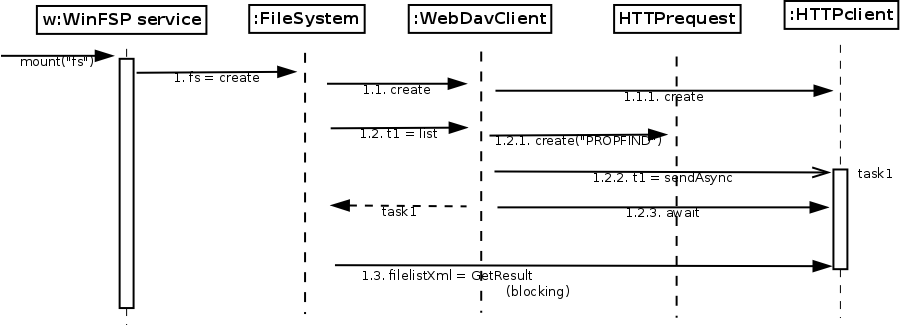
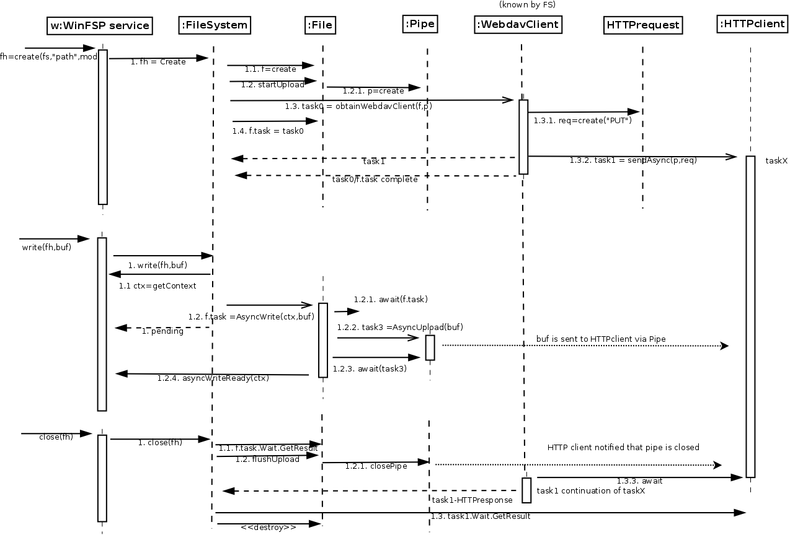

# YodaDrive

YodaDrive is a WebDAV client for Windows, allowing the user to mount a remove WebDAV server as a local drive. YodaDrive is derived from [KS2.Drive](https://github.com/FrKaram/KS2.Drive) written by Francois Karam, and depends on [WinFsp](https://github.com/billziss-gh/winfsp) written by Bill Zissimopoulos.

YodaDrive is a C# Visual Studio project, making use of the [WebDAVClient](https://github.com/saguiitay/WebDAVClient) library written by Itay Sagui (originally by Kees van den Broek).

YodaDrive has been optimized for iRODS servers accessed via `davrods`, but can be used for any WebDAV server.

## Limitations
Since the remote file system is WebDAV, changes that originate elsewhere are not visible until the user refreshes the view. YodaDrive does not implement WebDAV locking.

## Mode of operation
After a remote filesystem has been mounted, calls are made from Windows via WinFsp to `Open`, `Create`, `Read`, `Write` or `Close` files. YodaDrive handles `Read` and `Write` asynchronously, and all other calls synchronously.

For asynchronous `Read` and `Write` calls, YodaDrive returns `STATUS_PENDING` and later performs a callback when the `Read` or `Write` completes.  Closing a file with pending `Write` calls will wait for all scheduled writes to complete, before the `Close` call returns.

YodaDrive uses one connection for downloads, and at most two connections for uploads.

### Read
Downloads for all files in a remote filesystem are all managed on the same connection, with interleaved blocks for `Read` calls.  Each `Read` call is translated into a separate `GET` request.

### Write
Uploads are captured in a single `PUT` request if possible, as long as all `Write` calls address consecutive blocks. Each `PUT` request uses chunked mode, and blocks written are appended as chunks. The initial `Write` call does not have to address a block at the beginning of the file.

At most two uploads can be active at one time. Since consecutive writes are captured in a single `PUT` request, uploading two large files will prevent any other uploads for the duration. This is handled by postponing `Create` and `Write` calls until an upload connection becomes available; `Create` will pretend to succeed and `Write` will not have a callback until the actual block could be appended.

### ReadDirectory
`ReadDirectory` is performed synchronously, but makes use of the download connection and can be blocked by pending asynchronous `Read` calls. Note that WinFsp permits `ReadDirectory` itself to be asynchronous, but we do not implement it as such.

## State Diagrams

