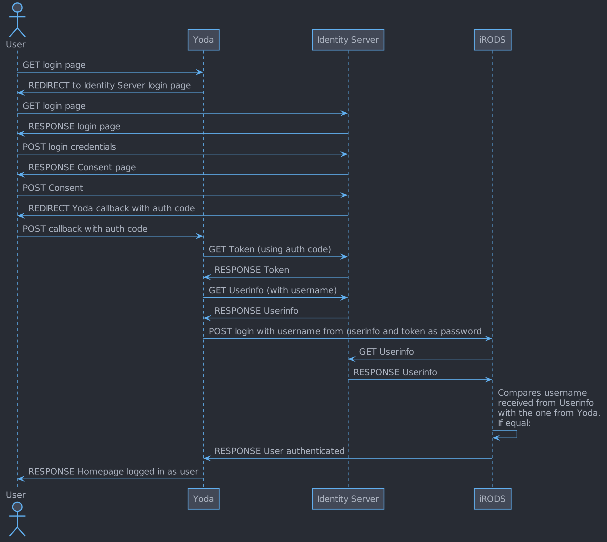

# Authentication

## PAM stack

When creating a session with the iRODS framework the authentication is handled by the Linux PAM (Pluggable Authentication Modules) stack.
The PAM stack for Yoda/iRODS can be found on the iCAT server at `/etc/pam.d/irods`.
In this file several modules are defined that check whether the passed credentials constitute a valid authentication.
Per module one can specify control values that determine the action that should be taken depending on the result of that module.
This way one can let the authentication cascade to following modules if previous ones failed, or signify that a certain module is require to succeed.
Please note that any changes to the PAM stack directly may have serious consequences for the security of the Yoda system and should not be necessary.
Instead, if you encounter issues with authentication, contact your functional admin for help.

### Available modules for Yoda

The default PAM stack for Yoda (which is the one for iRODS) has two modules for authentication:
 1. Local users on the system: *pam_unix*
 2. Radius server:  *pam_radius_auth*

 Additionally, one can configure two more authentication methods:
 3. For external users: uses *is-user-external.sh* and *external-auth.py*
 4. For authentication via OIDC protocol: *oidc.py*

For configuring the additional authentication methods, please look at the relevant documentation.

### Testing

To test the configured PAM stack, you can use the the `irodsPamAuthCheck` tool.
This is located on the iRODS server at `/usr/sbin/irodsPamAuthCheck`.
The program requires a username to be passed as a parameter and then prompts for the password.
These will then be passed to the PAM stack.
If successful, the output will be *Authenticated*, otherwise the output will be *Not Authenticated*.

## Yoda portal

The Yoda Portal is build on top of iRODS but is not the same application.
As such, when logging in to Yoda, an iRODS session has to be created as well.
Creation of the iRODS session goes by sending iRODS a PAM Auth Request and is handled as described in the previous section.
The authentication mechanism for Yoda is described below.

### Default login

When clicking the *Sign in* button in the Yoda Portal, you are taken to `user/gate.html`.
This page has an input field for the username and a button *Next* to go to the next step.
This preliminary login page `user/gate.html` is there to guide users to the correct authentication method based on their username.
By default no redirecting is done based on the username, unless configured otherwise.

After clicking *Next*, the user will be presented with the login page `user/login.html` with an additional input for the user password and a *Login* button.
Additionally there might be an extra button for OIDC login, which will be discussed shortly.

Note that after giving a username on `user/gate.html` this username is automatically filled in on the login page and can be modified.
If the username is modified to a different username which, according to configuration, should be redirected to a different login page, this will now happen at the moment the user clicks the *Login* button.
This way it is possible to force specific authentication methods for specific users.
For example, it has been built with OIDC login in mind for usernames that end with a specific domain that is configurable.

### OpenID Connect (OIDC)

When configured, it is possible to login into Yoda using OIDC.
The authentication flow is best explained via a diagram:

The above diagram shows the happy flow: no errors occur at any point during the flow.
As the login start with a request to Yoda, any errors should always end up at Yoda so that a sensible error message can be shown to the user.
