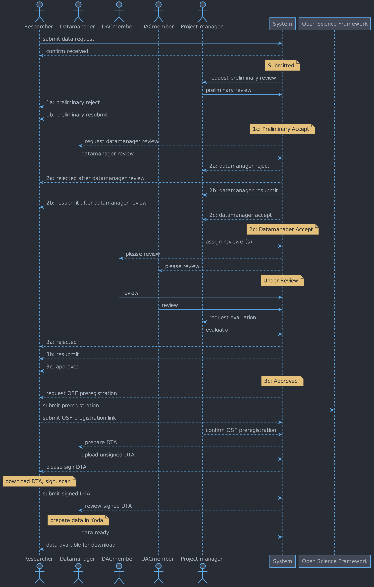

# Data requests module

## Introduction
This technical design document describes an approach to implementing support for
the submission, review and approval of requests to obtain research data stored
in Yoda.

## Definitions
- **Research group** A group of researchers belonging to a particular research
lab or otherwise collaborating on a common research goal. E.g. the Brain
Morphology Lab.

## Functional description
The supported workflows are described in this section. A sequence diagram
mapping the workflow is shown below.

### Submission of data requests
A researcher seeking to obtain research data stored in Yoda must be able to
submit a request for this data.

The request must belong to a research proposal, which is submitted along with
the data request. The research proposal must describe the purpose for which the
researcher wants to obtain the requested data.

### Management and review of data requests
A delegate of a research programme's or study's project manager must be able to
perform a cursory preliminary review of a data request.

Likewise, a data manager assigned as a custodian of (certain) data stored in
Yoda must be also able to submit a review of a data request.

After these preliminary reviews, a project manager must be able to assign a data
request for review to one or more members of a Data Management Committee (DMC)

The DMC member(s) must be able to review research proposals assigned to him.

### Final evaluation of research proposals
A project manager must be able to give a final evaluation of a research proposal
based on the reviews by the data manager and the DMC member(s), thereby
approving or rejecting the data request.

### Creation of data transfer agreements (DTAs)
Once a data request and its accompanying research proposal have been approved,
the data manager must be able to create a DTA specifying the terms and
conditions under which the requested data is made available to the requesting
researcher.

### Approval of DTAs
Once a DTA has been created, the requesting researcher must be able to view the
DTA and register his agreement to the terms and conditions specified therein.

### Release of requested data
After the DTA has been signed by the requesting researcher, the data manager
may release the requested data to him. The means by which the data is
transferred to the researcher is outside of the scope of the data request
module.

## Technical description
To keep the complexity of the module to a minimum, existing Yoda functionality
and modules are used to implement the functional requirements.

### Submission of data requests
To allow anyone, including newly registered Yoda users, to submit a data
request, a public iRODS collection (named, for example, "datarequests") must be
created. When a data request is submitted through a web form by a researcher, a
subcollection is created which will act as a folder for all files related to the
research proposal. The data request and research proposal is then saved to this
subcollection as a JSON-formatted file.

Because researchers only have ownership of subcollections they themselves have
created, they cannot access data requests by other researchers.

### Management and review of data requests
Project managers and data managers must be able to view all submitted data
requests.
They are enabled to do so by membership of a group (e.g.
"brainmorphlab-datamanagers"; see Group Manager) that has group manager
permissions on the public collection mentioned above (these include read and
write permissions). Because these permissions are recursive, they also apply to
the subcollections made by researchers.

Upon assignment of a research proposal for evaluation to a DMC member, the DMC
member is granted read and write permissions on the subcollection in which the
research proposal is stored.

DMC membership is determined by membership of a particular group (e.g.
"brainmorphlab-dmc"), acting as a pool from which the data manager may pick an
appropriate member.

A DMC member can evaluate a research proposal through a web form. The evaluation
is saved as a JSON-formatted file in the subcollection that also holds the
research proposal itself.

Because multiple research groups may use a Yoda instance, multiple data manager
and DMC groups may be created so that data requests meant for data of a
particular research group can be handled by data managers associated with that
research group.

### Final evaluation of research proposals
Project managers also belong to a particular group (e.g. "brainmorphlab-pm".
They have the same rights as those in the data manager group, thus allowing them
to view the research proposal and associated reviews.

A project manager can approve a research proposal through a web form that sets
the value of the status AVU of the research proposal subcollection to
"approved".

### Creation of DTAs
After the data request has been approved, the data manager creates a DTA and
adds it as a PDF file to the subcollection (through a web form). The researcher
will receive a request to upload as signed copy of this document.

### Approval of DTAs
The DTA created by the data manager is made available to the researcher. Once
the researcher has created a signed copy of the document, he can upload it
through a web form. The signed copy is saved in the subcollection. The data may
now be made available to the researcher by the data manager.
