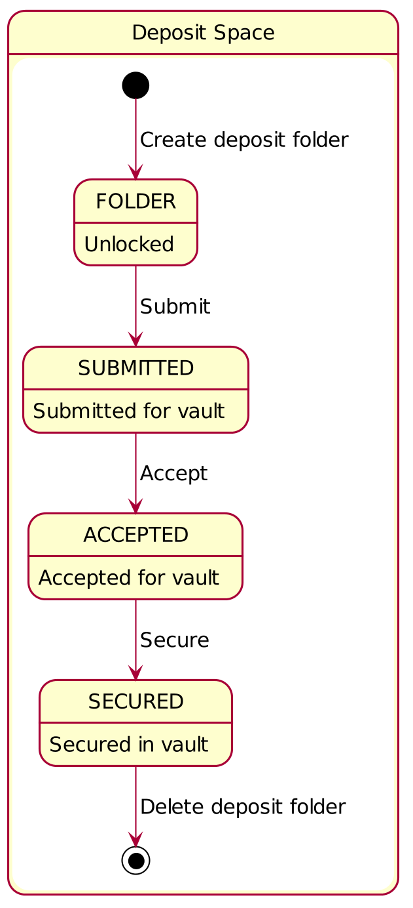
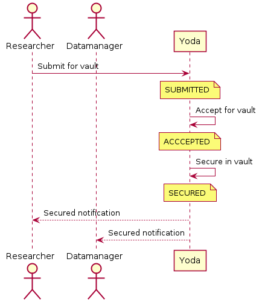

# Deposit space

## Introduction

The deposit space is described in this document.
The state diagram describes the possible states a folder in the deposit space can be in.
In the sequence diagram the interactions between the actors in the research space are documented.

## State diagram

## Sequence diagram

