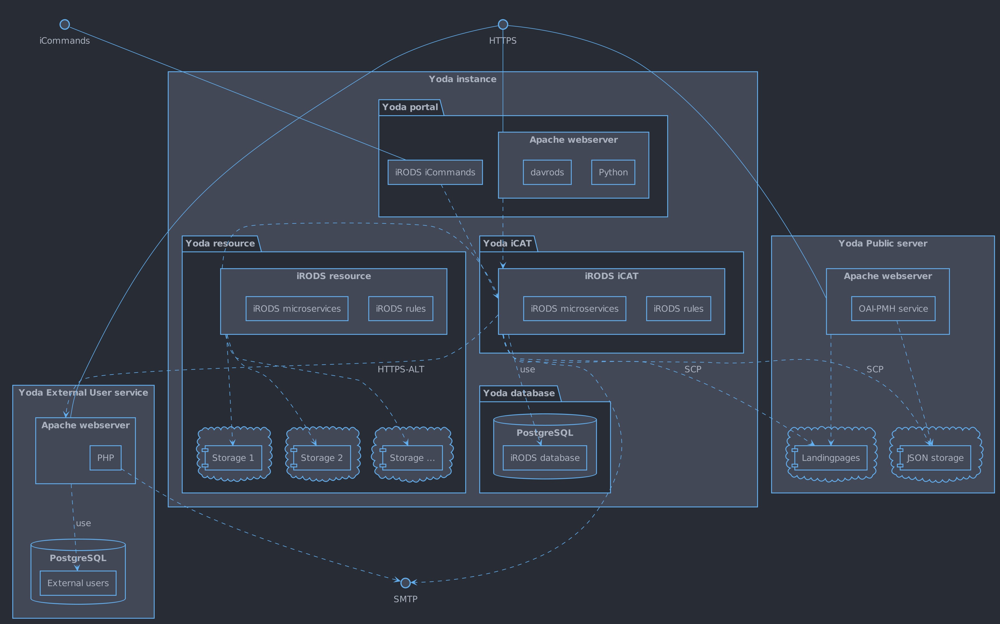

# System overview

Yoda is a research data management service that enables researchers and their partners to securely deposit, share, publish and preserve large amounts of research data during all stages of a research project.

Yoda consists of several core modules and has several additional modules providing additional functionality.

## Core modules

### Research space
The research space implements a data deposit workflow to the vault space.

[Technical design](research-space.md)

### Vault space
The vault space implements a FAIR data publication workflow.

[Technical design](vault-space.md)

### Statistics

[Technical design](statistics.md)

### Group manager
The group-manager is used to control access permissions of users based on group membership and the role inside a group.
It enables the distribution of access rights to data within Yoda with minimal aid of administrators.

[Technical design](group-manager.md)

### User

## Additional modules

### Intake

### Datarequest
Module adding support for the submission, review and approval of requests to obtain research data stored in Yoda.

[Technical design](data-requests.md)

### Deposit space
The deposit space implements a data deposit workflow to the vault space.

[Technical design](deposit-space.md)

## Overview

