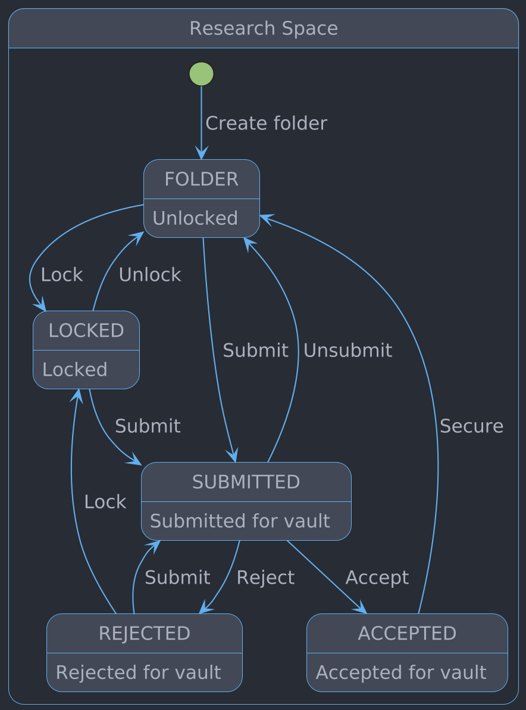

# Research space

## Introduction

The research space is described in this document.
The state diagram documents the states and transitions of a folder in the research space.
The sequence diagram documents the interactions between the actors in the research space.

## State diagram

## Sequence diagram

