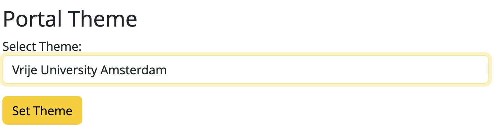

# Theme packaging

## Overriding the default templates and static files with user defined themes

Yoda allows for developers to add themes to the default (Utrecht University) theme.
Thus adding the possibility for developers to tweak a Yoda instance to their own look and feel.

Adding themes can be accomplished by overriding the default templates and static files that are supplied within the default (Utrecht University) Yoda.

Overriding can be done on two levels:  
1) Template (HTML) overriding  
2) Static (css/img/js) overriding

## Templates in Yoda
In the default setup, based on a modularly constructed flask environment, the required html templates are organized as follows:

/var/www/yoda  
&nbsp;&nbsp;&nbsp;&nbsp;/general/templates/general/\*.html  
&nbsp;&nbsp;&nbsp;&nbsp;/module_name/templates/module_name/\*.html

in which the general directory holds all basic html files, for instance the foundation of the application, in which the modules can reside.

## Overriding templates (HTML)
flask.cfg holds the yoda theme (filled by ansible but can be manually overridden):  
e.g.  
YODA_THEME = 'vu'  
YODA_THEME_PATH = '/var/www/yoda/themes'

When building a webpage yoda software first looks into the yoda/themes/vu directory whether a requested template is placed at that location.  
If so, this will be used (thus overriding the default supplied template).  
If not, the software will use the default template as supplied in the default (Utrecht University) situation.

From version 1.10, Yoda simplifies setting the portal theme with a new GUI on the Admin page. Once the templates are configured in the `yoda/themes/`, just select the theme  directly in the dropdown list; the theme is instantly updated. See the example below for changing the theme to VU.

<div style="text-align: center;">
    
</div>

The structure under yoda/themes/vu must be the same as the default structure as well as the template names must be the same.  
E.g.:  

/var/yoda/themes  
&nbsp;&nbsp;&nbsp;&nbsp;/uu1  
&nbsp;&nbsp;&nbsp;&nbsp;&nbsp;&nbsp;&nbsp;&nbsp;/general/base.html  
&nbsp;&nbsp;&nbsp;&nbsp;&nbsp;&nbsp;&nbsp;&nbsp;/research/browse.html  
&nbsp;&nbsp;&nbsp;&nbsp;...  

&nbsp;&nbsp;&nbsp;&nbsp;/uu2  
&nbsp;&nbsp;&nbsp;&nbsp;&nbsp;&nbsp;&nbsp;&nbsp;/research/revision.html  
&nbsp;&nbsp;&nbsp;&nbsp;&nbsp;&nbsp;&nbsp;&nbsp;/vault/browse.html  
&nbsp;&nbsp;&nbsp;&nbsp;...

In the above example following default HTML files will be overridden when uu1 or uu2 is selected as a theme:

For uu1:  
/var/www/yoda/general/templates/general/base.html  
/var/www/yoda/research/templates/research/browse.html

For uu2:  
/var/www/yoda/research/templates/research/revision.html  
/var/www/yoda/vault/templates/vault/browse.html


## Override static files (js, img, css)
To change the appearance or user experience on the frontend it is necessary to be able to override static files as supplied with yoda.  
This is only possible when the blueprint files are equipped with a different static_url_path

stats_bp = Blueprint('stats_bp', \__name__,  
&nbsp;&nbsp;&nbsp;&nbsp;&nbsp;&nbsp;&nbsp;&nbsp;&nbsp;&nbsp;&nbsp;&nbsp;&nbsp;&nbsp;&nbsp;&nbsp;&nbsp;&nbsp;&nbsp;&nbsp;&nbsp;&nbsp;&nbsp;&nbsp;&nbsp;&nbsp;&nbsp;&nbsp;&nbsp;&nbsp;&nbsp;&nbsp;&nbsp;&nbsp;template_folder='templates',  
&nbsp;&nbsp;&nbsp;&nbsp;&nbsp;&nbsp;&nbsp;&nbsp;&nbsp;&nbsp;&nbsp;&nbsp;&nbsp;&nbsp;&nbsp;&nbsp;&nbsp;&nbsp;&nbsp;&nbsp;&nbsp;&nbsp;&nbsp;&nbsp;&nbsp;&nbsp;&nbsp;&nbsp;&nbsp;&nbsp;&nbsp;&nbsp;&nbsp;&nbsp;static_folder='static/stats',  
&nbsp;&nbsp;&nbsp;&nbsp;&nbsp;&nbsp;&nbsp;&nbsp;&nbsp;&nbsp;&nbsp;&nbsp;&nbsp;&nbsp;&nbsp;&nbsp;&nbsp;&nbsp;&nbsp;&nbsp;&nbsp;&nbsp;&nbsp;&nbsp;&nbsp;&nbsp;&nbsp;&nbsp;&nbsp;&nbsp;&nbsp;&nbsp;&nbsp;&nbsp;**static_url_path='/assets'**)

On application level, in app.py, the static folder is set to 'assets' as well:  
app = Flask(\__name__, **static_folder='assets'**)

When the frontend requests for url's holding the keyword 'assets' it will check whether the set theme holds the requested static file according to following structure:

/var/yoda/themes  
&nbsp;&nbsp;&nbsp;&nbsp;    /uu1  
&nbsp;&nbsp;&nbsp;&nbsp;&nbsp;&nbsp;&nbsp;&nbsp;/static/css  
&nbsp;&nbsp;&nbsp;&nbsp;&nbsp;&nbsp;&nbsp;&nbsp;&nbsp;&nbsp;&nbsp;&nbsp;/js/...  
&nbsp;&nbsp;&nbsp;&nbsp;&nbsp;&nbsp;&nbsp;&nbsp;/research/static  
&nbsp;&nbsp;&nbsp;&nbsp;&nbsp;&nbsp;&nbsp;&nbsp;&nbsp;&nbsp;&nbsp;&nbsp;&nbsp;&nbsp;&nbsp;&nbsp;/css/..  
&nbsp;&nbsp;&nbsp;&nbsp;&nbsp;&nbsp;&nbsp;&nbsp;&nbsp;&nbsp;&nbsp;&nbsp;&nbsp;&nbsp;&nbsp;&nbsp;/js/..  
&nbsp;&nbsp;&nbsp;&nbsp;&nbsp;&nbsp;&nbsp;&nbsp;/vault/static/img/...  
&nbsp;&nbsp;&nbsp;&nbsp;/uu2  
&nbsp;&nbsp;&nbsp;&nbsp;&nbsp;&nbsp;&nbsp;&nbsp;/static/css/  
&nbsp;&nbsp;&nbsp;&nbsp;&nbsp;&nbsp;&nbsp;&nbsp;/research/static/js/  

If the requested file is not found, the default (Utrecht University) static file will be used.

General level url request:  
requested url = /assets/css/yoda-portal.css

When present, /yoda/themes/uu1/static/css/yoda-portal.css is returned.  
If not present fall back to default,  /yoda/static/css/yoda-portal.css is returned

Modular level url request:  
requested url = /research/assets/css/research.css

When present, /yoda/themes/uu1/research/static/css/yoda-portal.css is returned.  
If not present fall back to default  
 /yoda/research/static/research/css/yoda-portal.css is returned

## Resulting theme package structure
Putting templates and css together results in following theme package structure

/uu1  
&nbsp;&nbsp;&nbsp;&nbsp;/static/css/...  
&nbsp;&nbsp;&nbsp;&nbsp;/research  
&nbsp;&nbsp;&nbsp;&nbsp;&nbsp;&nbsp;&nbsp;&nbsp;/template.html  
&nbsp;&nbsp;&nbsp;&nbsp;&nbsp;&nbsp;&nbsp;&nbsp;/static/css/...  
&nbsp;&nbsp;&nbsp;&nbsp;&nbsp;&nbsp;&nbsp;&nbsp;&nbsp;&nbsp;&nbsp;&nbsp;/js/...  
&nbsp;&nbsp;&nbsp;&nbsp;&nbsp;&nbsp;&nbsp;&nbsp;&nbsp;&nbsp;&nbsp;&nbsp;/img/...  
&nbsp;&nbsp;&nbsp;&nbsp;...  
/uu2  
&nbsp;&nbsp;&nbsp;&nbsp;/static/css/...  
&nbsp;&nbsp;&nbsp;&nbsp;/research  
&nbsp;&nbsp;&nbsp;&nbsp;&nbsp;&nbsp;&nbsp;&nbsp;/template.html  
&nbsp;&nbsp;&nbsp;&nbsp;&nbsp;&nbsp;&nbsp;&nbsp;/static/css/...  
&nbsp;&nbsp;&nbsp;&nbsp;&nbsp;&nbsp;&nbsp;&nbsp;&nbsp;&nbsp;&nbsp;&nbsp;/js/...  
&nbsp;&nbsp;&nbsp;&nbsp;&nbsp;&nbsp;&nbsp;&nbsp;&nbsp;&nbsp;&nbsp;&nbsp;/img/...  
&nbsp;&nbsp;&nbsp;&nbsp;...  
/vu  
&nbsp;&nbsp;&nbsp;&nbsp;/static/css/...  
&nbsp;&nbsp;&nbsp;&nbsp;/research  
&nbsp;&nbsp;&nbsp;&nbsp;&nbsp;&nbsp;&nbsp;&nbsp;/template.html  
&nbsp;&nbsp;&nbsp;&nbsp;&nbsp;&nbsp;&nbsp;&nbsp;/static/css/...  
&nbsp;&nbsp;&nbsp;&nbsp;&nbsp;&nbsp;&nbsp;&nbsp;&nbsp;&nbsp;&nbsp;&nbsp;/js/...  
&nbsp;&nbsp;&nbsp;&nbsp;&nbsp;&nbsp;&nbsp;&nbsp;&nbsp;&nbsp;&nbsp;&nbsp;/img/...  
&nbsp;&nbsp;&nbsp;&nbsp;...  

## Compiling theme CSS
Building theme CSS:
```
sudo su yodadeployment
cd /var/www/yoda/static/src/

# Install npm
nvm install v18

# Install sass compiler
npm install
npm install -g sass

# Build (default) UU theme
sass --style compressed build_uu.scss ../../static/css/yoda-portal.css

# Build (custom) VU theme
sass --style compressed build_vu.scss ../../themes/vu/static/css/yoda-portal.css
```

### Select2 theming in the group manager

To match the select2 fields in the group-manager with the colors of the main theme, the select2 theme must be compiled.

Assuming that the steps to compile the main theme CSS for all of Yoda have already been followed, the following can be run to compile the select2 bootstrap theme, for example for the (default) uu theme:
```
sudo su yodadeployment
cd /var/www/yoda/static/src/select2-bootstrap-5-theme/src
sass --style compressed select2-theme-uu.scss ../../../../group_manager/static/group_manager/lib/select2-bootstrap-5-theme/select2-bootstrap-5-theme.css
```

For other themes the css is similarly an override of the default select2 uu theme. For the vu theme:
```
sass --style compressed select2-theme-vu.scss ../../../../themes/vu/group_manager/static/group_manager/lib/select2-bootstrap-5-theme/select2-bootstrap-5-theme.css
```

To create another select2 theme first copy the select2-theme-uu.scss file, and then change "uu" to the name of your theme in this line:
```scss
@import "../../uu/variables";
```
The theming is based on this [select2 bootstrap 5 theme](https://github.com/g10f/select2-bootstrap-5-theme) fork.

## DavRODS theming

DavRODS uses different theming logic than the portal. By default, it uses the themed logo of the portal.
The logo is linked to the UU website. Use the `yoda_davrods_logo_path` and `yoda_davrods_logo_link`
parameters to change this behaviour.

For more advanced changes, it will be necessary to customize the [DavRODS layout templates](https://github.com/UtrechtUniversity/yoda/tree/development/roles/yoda_davrods/templates).
