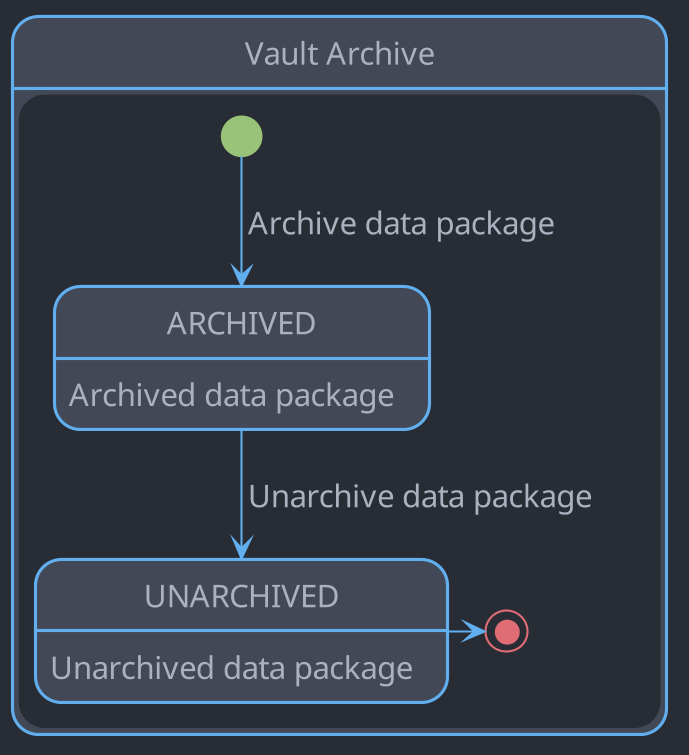
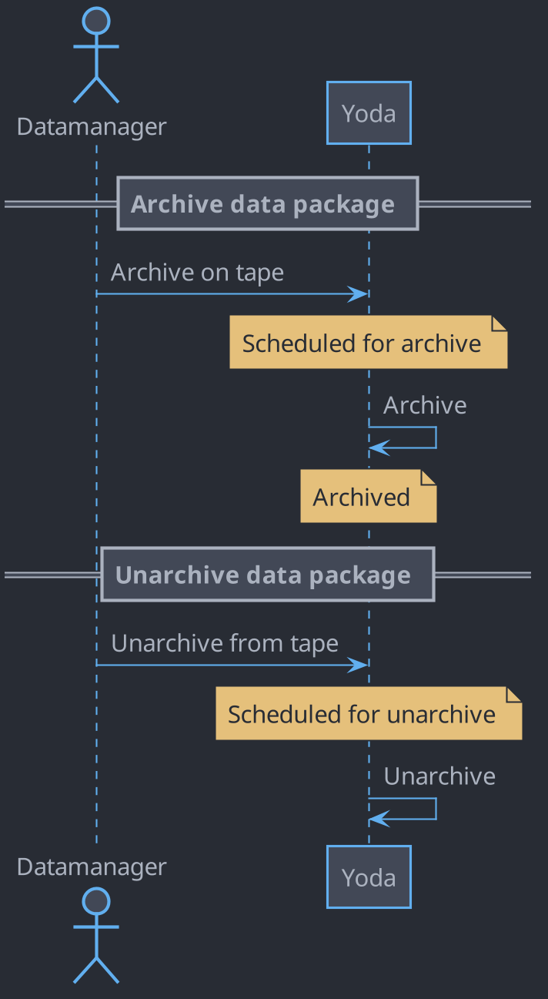

# Vault archive

## Introduction

The vault archive is described in this document.
The state diagram documents the states and transitions of a data package in the vault archive.
The sequence diagram documents the interactions between the actors in the vault archive.

## State diagram

## Sequence diagram

