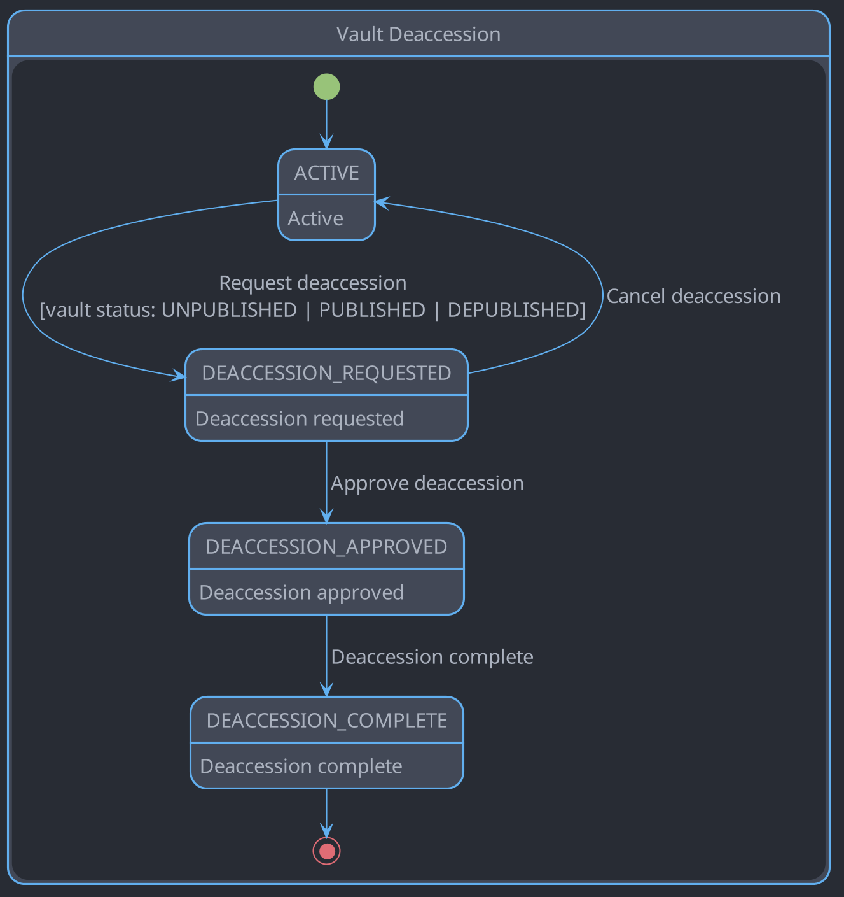
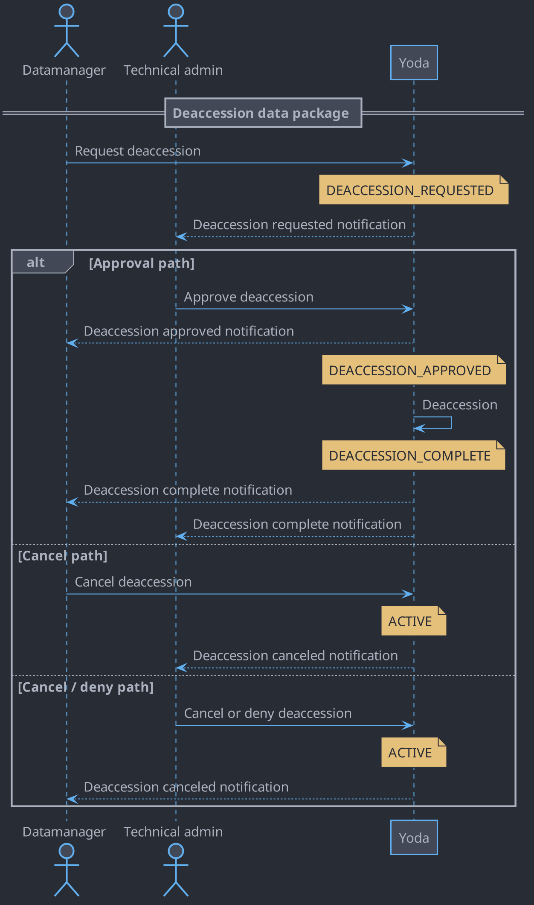

# Vault deaccession workflow

## Introduction

The vault deaccession workflow is described in this document.
The state diagram documents the states and transitions of a data package in the vault when deaccessioning.
The sequence diagram documents the interactions between the actors in the vault when deaccessioning.

## State diagram

## Sequence diagram

