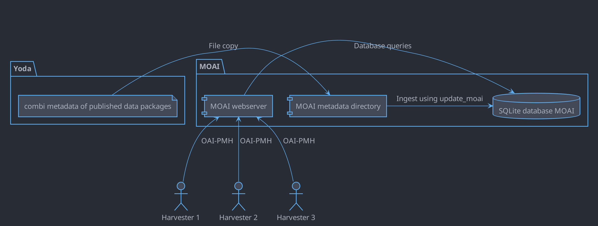

# Yoda MOAI service

## Yoda MOAI

MOAI provides a harvesting interface based on the [OAI-PMH protocol](https://www.openarchives.org/pmh). Other software
can use this harvesting interface to retrieve metadata of published Yoda data packages. MOAI can provide metadata to harvesters in different
formats, which are specified using metadata prefixes. Currently, metadata prefixes are available for Dublin Core (`oai_dc`),
Datacite (`datacite` or `oai_datacite`) and ISO 19139 (`iso19139`).

## Architecture

When a data package is published in Yoda, the metadata combi file is copied from the provider or consumer server to the MOAI server
using SCP. The `update_moai` job on the MOAI server scans the uploaded metadata combi files every five minutes and ingests the metadata into a local
SQLite database. The MOAI web server provides a public OAI-PMH endpoint that can be used by harvesters. The web server
uses the SQLite database as its source of information.

