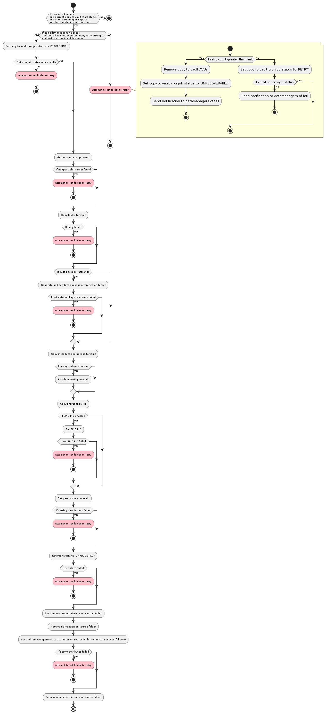

# Copy to vault diagrams
The following is a diagram of the state transitions of the cronjob status (not the folder status):

The following is a diagram of the process of securing an individual folder for Yoda versions 1.10 and higher:

