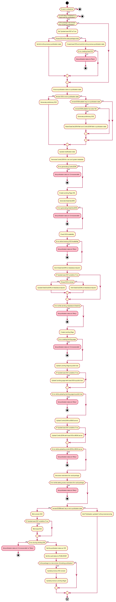

# Publication Process
All state is kept in key-value-pair ``*publicationState`` and persisted into metadata after each step.
Configuration is pulled from metadata on the ``UUSYSTEMCOLLECTION`` iRODS collection and kept in ``*publicationConfig``.
Credentials are pulled from the Yoda credential store (store_config.json).
Each step has a rule with the configuration and state as arguments.
Temporary collection will be rods owned and located at ``UUSYSTEMCOLLECTION/publish``.

**Versioning**
DOI versioning was introduced in Yoda v1.9. 
With the publication of first version of the data package, version DOI is registered by the publication process.
When the data package is published for the second time, a new version DOI and base DOI is registered. The previous version of the data package is updated with the same base DOI so that the versions are linked. 

For further versions of the data package, a new version DOI is registered. The previously registered base DOI is added in the ``*publicationState``.

The base DOI will always resolve to the latest version of the data package.


**Precondition:**
- Vault package has ```APPROVED_FOR_PUBLICATION``` status
- Actor is rodsadmin

**Step 0:** Set publicationState.status to PROCESSING

**Step 1:** Load configuration from UUSYSTEMCOLLECTION
- public server
- moai server
- Yoda prefix
- DataCite prefix

**Step 2:** Generate Yoda DOI
- Generate Random ID
- Set random ID in state
- Add prefixes
- Set Yoda DOI

**Step 3:** Determine Last Modification Time
- Add to State

**Step 4:** Generate Combi JSON consisting of user and system metadata
- Save CombiJSON in temporary collection
- Add path of CombiJSON to state

**Step 5:** Generate DataCite JSON from Combi JSON
- Add DataCite JSON to state
- On failure:
	- Flag package with unrecoverable failure
	- Bail

**Step 6:** Check if DOI is in use
- If in use:
	- remove DOI and RandomId from State
	- Flag package for retry
	- Bail
- If not in use:
	- Add DOI to metadata of Vault Package

**Step 7:** Send DataCite JSON
- Retrieve DataCite url and DataCite credentials from credentials store
- API request to metadata endpoint with DataCite JSON
- Put result in state
- On request failure:
	- Flag package for retry
	- Bail
- On metadata incorrect failure:
	- Flag package as unrecoverable
	- Bail

**Step 8:** Create Landing Page
- Use CombiJSON to generate landing page
- Add landing page path to state
- On failure:
	- Flag package with unrecoverable failure

**Step 9:** Create Landing Page URL
- Use public host, prefixes and randomId for landing page url
	(Example: http://public.yoda.uu.nl/i-lab/UU01/Y7B2DD.html)
- On failure:
	- Should never fail at this stage

**Step 10:** Secure copy landing page to public server
- Use secure copy to push landing page
- On failure:
	- Flag package for retry

**Step 11:** Secure copy metadata for Yoda MOAI server
- Use secure copy to push combi JSON to MOAI server
- On failure:
	- Flag package for retry

**Step 12:** Mint DOI with landing page
- API request to DOI end point with landing page url
- On failure:
	- Flag package for retry

**Step 13:** the vault package is given ```PUBLISHED``` status.


Further detailed diagram for each step is as follows:


# Depublication process
This is very similar to the publication process. The DOIs and URLs were preserved in the ```UUSYSTEMCOLLECTION``` metadata, and are reused by the depublication process.   
Depublication is performed with the differences noted below.

**Precondition:**
- Vault package has ```PENDING_DEPUBLICATION``` status
- Actor is rodsadmin

Step 2 of the publication process above is skipped. A DOI has already been generated.

**Step 4:** Generate Combi JSON consisting only the system metadata, as the user metadata is being removed.

Step 5 and 6 of the publication process above are skipped.

**Step 7:** Remove (i.e. hide) DataCite metadata
- Retrieve DataCite url and DataCite credentials from credentials store
- API request to remove metadata from Datacite
- put result in state
- On request failure:
	- Flag package for retry
	- Bail

Step 9 is skipped, the landing page URL has already been generated.

Step 12 is skipped, the DOI at DataCite has already been minted.

**Step 13:** the vault package is given ```DEPUBLISHED``` status.

# Republication process
The republication process is very similar to the publication process.  The DOI and URLs were preserved in the ```UUSYSTEMCOLLECTION``` metadata, and are reused by the republication process.

Precondition:
- Vault package has ```PENDING_REPUBLICATION``` status
- Actor is rodsadmin

**Step 13:** the vault package is given ```PUBLISHED``` status.
