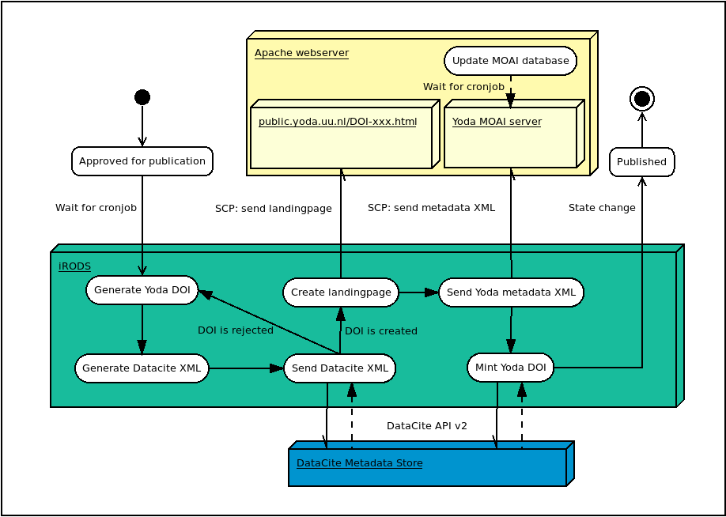

# Provisioning CKAN CATALOGS #

## Overview

## MOAI
MOAI offers harvesting functionality following the OAI-PMH standard with the flexibility to serve different metadata prefixes.
Currently, for the YoDa application datacite is implemented as a metadata prefix.

## Provisioning MOAI database
When publishing datasets from within YoDa, the corresponding yoda-metadata.xml is put in a location where MOAI can read and process it.  
Each 5 minutes (configrable) the indicated folder (configurable) is scanned and newly published XML files are provisioned tot he internal sqlite database of MOAI.  
The data is prepared in the database as such that it is able to provide output in XML form, datacite format, on request of a harvester.
Any OAI-PMH harvester, able to ‘read’ datacite format, is able to harvest YoDa through the endpoint serviced by MOAI.

**Endpoint: moai/moai/**

## MOAI Technical:##
### Provision from YoDa  
*python -> yoda.py*  
The  script reads all yoda-metadata.xml files that have been published and are placed in a specific folder. After processing it puts the found content into the MOAI SQLITE database.

select * from sets;  
select * from records;

### Deliver metadata in datacite format to harvesters  
*python -> datacite.py*  
Prepares the output data in such a way that the application data of YoDa, originally held in yoda-metadata.xml files, can be outputed to an XML response with datacite as a metadata prefix.

#  CKAN catalog
I-lab uses CKAN as basis for catalog functionality.  
CKAN is generic software that can be tailored to become an entirely blabla application.
It uses several modules / extensions to be able to form CKAN standard product into an application that can handle YoDa specific data.

## Harvest sources   
A harvest source is a configuration, added within CKAN, to instruct where to harvest for data and how to deal with the harvested data from the source (in this case YODA).  
This by passing information to the ckan module CKANEXT-OAIPMH (see further)

Harvest sources, which is functionality added to CKAN by 3rd party module ‘ckan-harvester’, is mainly a configuration holding:  
-endpoint  
-params to tell configure the source freely as an application programmer  
-harvest type (either CKAN/OAIPMH when OAI-PMH extension added)

CKANEXT HARVESTER uses a POSTGRESQL database to be able to harvest.  

## Harvesting stages
Harvesting is realised in following three stages:

- Gather stage  
Through OAI PMH gather all present datapackage and create a list of them in the postgresql database.

- Import stage  
One by one handle the list of gather Ids and add them tot he database as a JSON-object separately.

- Fetch stage  
The data that is fetched can now be processed and, in accordance with module CKANEXT-CUSTOM-THEME,  be saved into CKAN itself.
This has to be in alignment with the theme as the theme contains the ‘application’ and this needs to be ‘fed’ correctly from the database.  
This goes especially for the extra – fields.

The processing of the fetched data is dealt with within another extension. CKANEXT-OAIPMH.  
Thus, any party can tailor CKAN to its own wishes.  
This extension is under development by the YoDa-team: CKANEXT-OAIPMH

## CKAN Extension CKANEXT-OAIPMH
A generic component that currently is used for catalog applications iLAB and EPOS.  
It allows for harvesting through the OAI-PMH standard.  
CKANEXT-OAIPMH processes the harvested data that was collected at the endpoint within the harvest source.

Driven by the parameters as stated in the CKAN **harvest source** that initiated the harvest process, CKANEXT-OAIPMH module can be configured to treat data differently corresponding to the active configration.

In our case this component handles two entirey different sources for entirely different applications:  
1) EPOS, and  
2) ILAB

The differentiation can be made by passing the correct parameters into the Harvest source:

Configuration:   
*Voor ILAB datacite:*  
{"metadata_prefix": "datacite",  
"application": "ILAB"  
}

*EPOS iso metadataPrefix:*  
{"metadata_prefix": "iso19139",  
"application": "EPOS",  
"set":"~P3E9c3ViamVjdCUzQSUyMm11bHRpLXNjYWxlK2xhYm9yYXRvcmllcyUyMg"  
}

*EPOS datacite metadataPrefix:*  
{"metadata_prefix": "datacite",  
"application": "EPOS",  
"additional_info": "kernel4",  
"set":"~P3E9c3ViamVjdCUzQSUyMm11bHRpLXNjYWxlK2xhYm9yYXRvcmllcyUyMg"  
}
NB "set" is part of the OAIPMH standard

The CKAN-OAIPMH extension is programmed as such that it will provision CKAN based upon the above parameters.
Main differentation is the application. Currently EPOS and iLAB.

# Application specific handling

## iLAB
metadataPrefix = datacite  
The organisation linked to the harvest source is added to each datapackage as being the owning organisation (owner_org: see further CKAN fields).

## EPOS
metadataPrefix = ISO

*-Owner organisation is determined from within harvested data*  
NO new organisations are added programmatically when processing the harvested data.  
Otto Lange, CKAN admin, controls this proces in the sense that he controls which organisations are known within CKAN.  
If a passed organisation is present in CKAN already, that organisation is used as owner organisatin.  
If not known within CKAN -> ‘Other lab’ is default.

Thus, organization ‘Other lab’ is an indicator of datapackages from unkown origins (from the point of view of CKAN).

*-Maintainer is hardcoded*  
Currently, the maintainer is hardcoded in the source.  
This as it was not clear how to actually get this dymanically.

        self.package_dict['maintainer'] = 'GFZ Potzdam'
        self.package_dict['maintainer_email'] = 'info@gfz.de'

*-Special 'package reference' handling *  
Within the EPOS application there are 3 types of references regarding a package:

-supplement to  
-cites  
-references  

Within the harvested XML that minimal information is passed regarding these references.  
Therefore, lookup functionality is added to get more details via GFZ.

http://dataservices.gfz-potsdam.de/getcitationinfo.php?doi=http://dx.doi.org/' op basis van DOI

Example:  
http://dataservices.gfz-potsdam.de/getcitationinfo.php?doi=http://dx.doi.org/10.1007/s11214-010-9693-4

Based upon the received citation info, the CKAN package can be filled with more elaborate information.

## Standard CKAN fields
**Standard CKAN fields**

-author  
Author of the package.  
-owner_org    
Organisation that owns the package and as such shown on the datapackage view  
-title  
Title of a package  
-notes  
Description of a package  
-license_id  
The license under which the datapackage can be used.  
-url  
URL referring to more detailed information regarding the datapackage  
-groups  
A datapackage can be linked to N groups.  
-tags  
A datapackage can be tagged to…  
-formats  
-maintainer  
Reference to where the CKAN package is maintained.  
-maintainer_email  
-extras
Key value pairs enabling a CKAN programmer to customise datapackage data to

**Extra fields for iLAB**:  
Locations covered  
Dataset contact  
Created at repository  
Year of publicatoin  
Publisher  
Collection period  

**Extra fields for EPOS**:  
Dataset contact  
Created at repo  
Publication date  
Publisher  
Is supplement to  
Cites  
References  
geobox-wLong  
geobox-eLong  
geobox-nLat  
geobox-sLat  

## CKANEXT-CUSTOM-THEMES
Mainly frontend items that transform standard CKAN into a tailored application. Eg. the iLAB catalog.  
This by overruling view files,  add static content like images and javascript.
