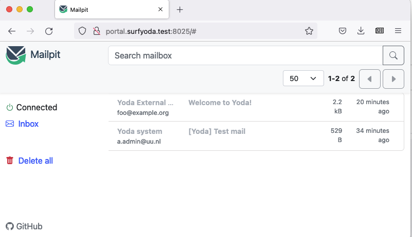

# Development tips

A collection of tips to make Yoda development easier.

## General

Watch latest iRODS log without unnecessary noise:
```bash
ls -t /var/lib/irods/log/rodsLog* | head -n1 | xargs -n 1 -- tail -f | grep -v "Agent process started for puser=rods"
```

Watch flake8 check on Python code:
```bash
watch flake8
```

Run flake8 check on source file change (requires the `entr` package):
```bash
ls *py | entr flake8
```

Reload Flask on project change (requires the `entr` package; run as root):
```bash
cd /var/www/yoda && find /etc/irods/yoda-ruleset . \( -path *.swp -o -path */node_modules/* -o -path ./venv -o -path ./.git \) -prune -o -print | entr touch yoda_debug.wsgi
```

Rebuild portal Javascript assets on source file change:
```bash
./node_modules/.bin/webpack -d -w
```

## Testing
Mount vagrant guest folder on host (e.g. `/etc/irods/yoda-ruleset/` so you can run `pytest` on the local machine):
```bash
# Mount
sshfs -o IdentityFile=/home/dev/.vagrant.d/insecure_private_key -p 2222 vagrant@127.0.0.1:/etc/irods/yoda-ruleset yoda-ruleset

# Umount
fusermount -u yoda-ruleset
```

Run pytest from mounted folder (see previous tip):
```bash
mkdir -p /tmp/cache && pytest -o cache_dir=/tmp/cache
```

## Mailpit

The development environments have [Mailpit](https://github.com/axllent/mailpit) for testing email during development.
In order to see what messages Yoda would have sent, browse to port 8025 on the iCAT or EUS server of the environment.



## Datarequest module
Remove all existing data requests (to declutter your _development_ environment):
```bash
icd /tempZone/home/datarequests-research && ils | grep \ \  | sed 's/\ \ C-\ //' | xargs -I COLLPATH sh -c "ichmod -M -r own rods COLLPATH && irm -r COLLPATH"
```
