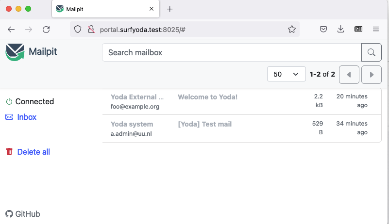

# Development tips

A collection of tips to make Yoda development easier.

## General

Watch latest iRODS log without unnecessary noise (as user irods):
```bash
ls -t /var/lib/irods/log/rodsLog* | head -n1 | xargs -n 1 -- tail -f | grep -v "{rods#tempZone} Agent process started from 127.0.0.1"
```

Watch flake8 check on Python code:
```bash
watch flake8
```

Run flake8 check on source file change (requires the `entr` package):
```bash
ls *py | entr flake8
```

## Yoda portal
Reload Flask on project change (requires the `entr` package; run as root):
```bash
cd /var/www/yoda && find /etc/irods/yoda-ruleset . \( -path *.swp -o -path */node_modules/* -o -path ./venv -o -path ./.git \) -prune -o -print | entr touch yoda_debug.wsgi
```

### Yoda portal metadata form page
To change how the metadata form module looks and behaves (but *not* for changing a particular metadata or ui schema):
1. Go into the metadata form folder: `cd /var/www/yoda/metadata_form/src`
2. Install npm: `npm install`
3. Make your changes to the js code
4. Run: `npm run build-all`. This will build the metadata forms for research, deposit, and vault modules, for production.

Some other commands you can run with `npm run` in this directory:
- `build-[module]`: you can specify an individual module (research, deposit, or vault) to build the metadata form for, for example: `build-research`
- `build-[module]-dev`: you can specify an individual module (research, deposit, or vault) to build the metadata form for, and to build it in development mode for easier debugging.

Rebuild portal Javascript assets on source file change:
```bash
./node_modules/.bin/webpack -w --name all --mode development
```

### Yoda portal datarequest page
To make changes to the Datarequest module in the portal:
1. Go to the Datarequest folder containing the JS code: `cd /var/www/yoda/datarequest/static/datarequest/js`
2. Install npm: `npm install`
   - NOTE: The Datarequest module currently has a dependency conflict caused by the `react-bootstrap-table-next` package. To temporarily fix this in your _development_ environment, you can downgrade packages `react` and `react-dom` to version 16.3.0 in the `package.json` file.
3. Make your changes to the JS code
4. Run the webpack to rebuild the Datarequest module: `./node_modules/.bin/webpack`

## Mailpit

The development environments have [Mailpit](https://github.com/axllent/mailpit) for testing email during development.
In order to see what messages Yoda would have sent, browse to port 8025 on the iCAT or EUS server of the environment.



## Datarequest module

To remove all existing data requests (to declutter your _development_ environment):
```bash
icd /tempZone/home/datarequests-research && ils | grep \ \  | sed 's/\ \ C-\ //' | xargs -I COLLPATH sh -c "ichmod -M -r own rods COLLPATH && irm -r COLLPATH"
```
